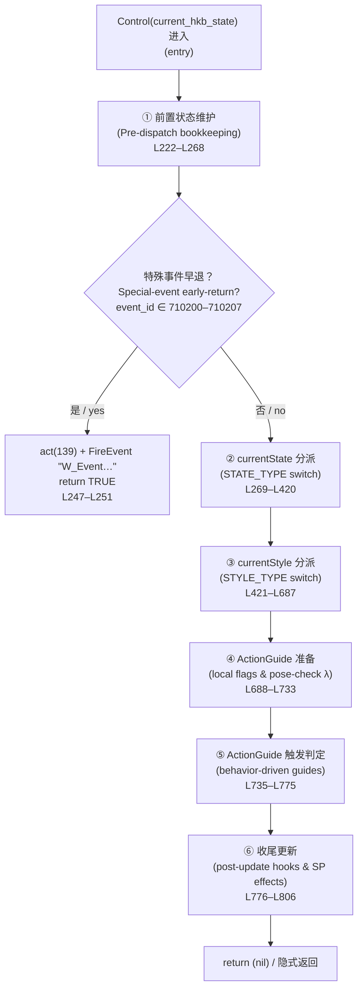
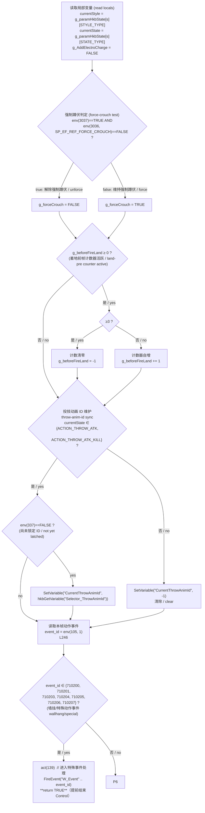
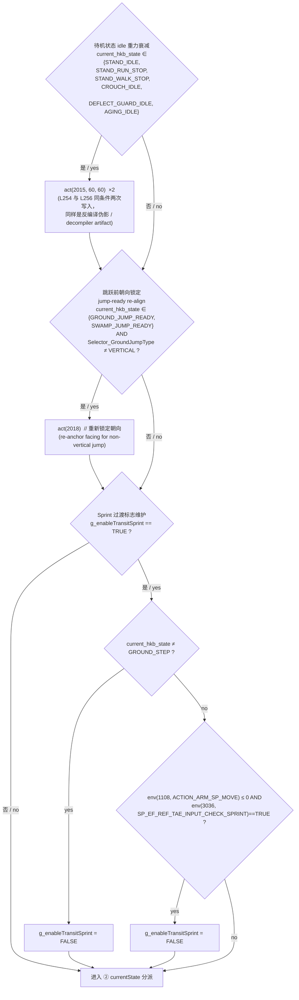
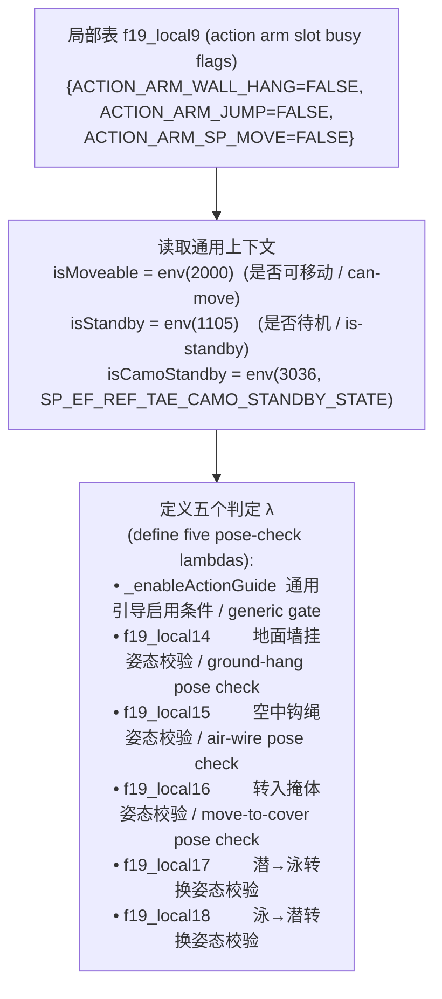
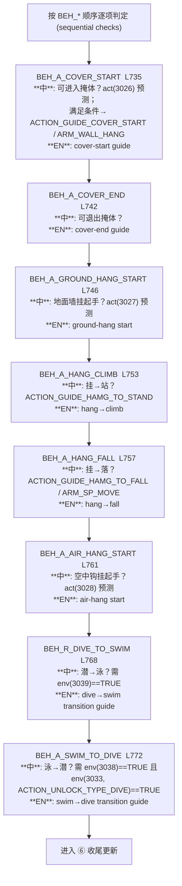

# `c0000.dec.lua` — `Control(current_hkb_state)` 函数逻辑流程图

> 对应源码：[action/script/c0000.dec.lua](../action/script/c0000.dec.lua) 第 221–807 行。
>
> 这是玩家（`c0000`）每帧 `UpdateState()` 链中第一个被调用的核心控制函数。它**不直接触发状态转换**（那是后续 `Validate()` 的工作），而是负责：
> 1. 维护与本帧相关的全局标志（如 `g_forceCrouch`、`g_beforeFireLand`、`g_AddElectroCharge`、`g_enableTransitSprint`）
> 2. 按 `currentState`（**状态类别 / state-type**）发出引擎指令（`act(...)`）
> 3. 按 `currentStyle`（**姿态类别 / style-type**）发出更细的引擎指令
> 4. 处理动作引导（ActionGuide）的可见性
> 5. 调用一系列 `_Update*` 辅助函数收尾
>
> 标注规则：
> - **中**=中文逻辑说明；**EN**=英文短标签
> - `act(id, …)` / `env(id, …)` / `SetVariable` / `FireEvent` 等保留原名
> - 行号格式为 `c0000.dec.lua:NNN`

---

## 一、顶层结构图（Top-level structure / 顶层结构）

---

## 二、① 前置维护（Pre-dispatch bookkeeping，L222–L268）

> `event_id == 710200/710201/710203` 在源码中重复出现两次，应是反编译伪影（同一组判断被生成器重复展开）。

---

## 三、② `currentState` 分派（STATE_TYPE switch，L269–L420）

`currentState` 决定**这一帧应当抑制 / 允许哪类全局行为**：是否解锁主菜单、是否停止自动锁定（auto-aim）、是否需要走 NPC 武器路径等。每一分支结束就跳出。

```mermaid
flowchart TD
    S0["按 currentState 选择分支 (switch on currentState)"]
    S0 --> SA["STATE_TYPE_STANDBY  L269<br/>**中**: 待机；按 env(201) 决定是否打开速度更新<br/>**EN**: idle; gate via env(201), call act(9100), _SpeedUpdate;<br/> 若 g_autoAimFlag==TRUE 调 _StopAutoAim()"]
    S0 --> SB["STATE_TYPE_LOWER  L282<br/>**中**: 下肢动作；g_isUpperAction=TRUE, act(101,TRUE)+_SpeedUpdate<br/>**EN**: lower-body active; mark upper-action"]
    S0 --> SC["STATE_TYPE_UPPER_STANDBY  L286<br/>**中**: 上肢待机；同上 + act(9100) + StopAutoAim<br/>**EN**: upper-standby"]
    S0 --> SD["STATE_TYPE_STANDBY_GUARD / _STANDBY_SUB_GUARD  L293<br/>**中**: 待机防御；附加 SP_EFFECT_STYLE_DEFLECT_GUARD<br/>**EN**: guard-standby; apply deflect-guard FX"]
    S0 --> SE["STATE_TYPE_STANDBY_ATK[_HOLD]  L301<br/>**中**: 起手攻击；act(101,TRUE)+act(9100)+_SpeedUpdate<br/>**EN**: pre-attack stance"]
    S0 --> SF["STATE_TYPE_ACTION_ATK / THROW_ATK / THROW_ATK_KILL /<br/>ATK_HOLD / UPPER_ACTION_ATK  L305<br/>**中**: 主动攻击；按 _IsNpcWeapon() 选 act(9103) 参数；<br/>持锁敌时停 auto-aim<br/>**EN**: active attack; NTC anim selection"]
    S0 --> SG["STATE_TYPE_ACTION_GUARD / SUB_GUARD  L314<br/>**中**: 主动防御 FX + 锁敌时停 auto-aim<br/>**EN**: active guard"]
    S0 --> SH["STATE_TYPE_ACTION_ITEM_USE / UPPER_…_ITEM_USE  L319<br/>**中**: 道具使用；非望远镜&amp;非锁敌 时 act(150)<br/>**EN**: item-use posture"]
    S0 --> SI["STATE_TYPE_UPPER_ACTION  L323 (空 / no-op)<br/>STATE_TYPE_ACTION  L324 (空 / no-op)"]
    S0 --> SJ["STATE_TYPE_REACTION* (含 ATK/ATK_HOLD/<br/>THROW_DEF/THROW_ESCAPE)  L325<br/>**中**: 受动反应；REACTION_ATK 走 NPC 武器路径；<br/>STAND/CROUCH 姿态 + CAMO_STANDBY → 强制 _SpeedUpdate；<br/>THROW_DEF 时设置 Selector_ProneDirection<br/>**EN**: passive reaction handling"]
    S0 --> SK["STATE_TYPE_REACTION_MAP_ENTER  L347 (空)"]
    S0 --> SL["STATE_TYPE_REACTION_DEATH* (六种死亡变体)  L348<br/>**中**: 死亡反应；act(3032) 关闭 UI；<br/>THROW_DEATH_START 设置 FallDmgDir/IndexDeath/ProneDirection<br/>**EN**: death-reaction setup; choose dir variant"]
    S0 --> SM["STATE_TYPE_REACTION_GUARD / SUB_GUARD  L361<br/>**中**: 防御受击 FX + 停锁敌<br/>**EN**: guard-reaction"]
    S0 --> SN["STATE_TYPE_EVENT  L366<br/>**中**: 普通过场；非剧情中(env(339,1)==FALSE)调 act(9102);<br/>act(3032) 关 HUD；STATUE_INITIALIZE 时 act(2018)<br/>**EN**: cutscene/event"]
    S0 --> SO["STATE_TYPE_EVENT_ENABLE_ACTION_BUTTON  L377<br/>**中**: 含交互按钮的过场；act(138)+act(3034,TALK_SKIP);<br/>EVENT390002/711010 额外 BASE 按钮；<br/>STATUE_ATTACH_START 时 act(2018)<br/>**EN**: event-with-action-button"]
    S0 --> SP["STATE_TYPE_EVENT_NPC_TALK_LOOP/REACTION/END /<br/>EAVESDROP_LOOP/END  L393<br/>**中**: NPC对话 / 偷听场景；按当前节点设音效引用<br/>(EZ_STATE_REF_SND_*)；NPC_TALK_LOOP 末尾 act(2018)<br/>**EN**: NPC-talk / eavesdrop scene audio"]

    SA --> ENDS["进入 ③ currentStyle 分派"]
    SB --> ENDS
    SC --> ENDS
    SD --> ENDS
    SE --> ENDS
    SF --> ENDS
    SG --> ENDS
    SH --> ENDS
    SI --> ENDS
    SJ --> ENDS
    SK --> ENDS
    SL --> ENDS
    SM --> ENDS
    SN --> ENDS
    SO --> ENDS
    SP --> ENDS
```

---

## 四、③ `currentStyle` 分派（STYLE_TYPE switch，L421–L687）

`currentStyle` 决定**当前姿态下需要的引擎设置**：可投技状态（`act(160)` 攻方 / `act(161)` 守方）、`_LandReset`（着地复位）、`WireMove` 距离预计算（`act(3023)`）、主菜单可用性（`act(147)/act(138)/act(3034)`）等。

```mermaid
flowchart TD
    Y0["按 currentStyle 选择分支 (switch on currentStyle)"]

    Y0 --> YA["STYLE_TYPE_STAND  L421<br/>**中**: 站立姿态；<br/>• _LandReset<br/>• STEP_FROM_DAMAGE/DOWN + ACCEPT_ITEM_USE_PRIORITIZE → act(2002, SP_EF_ITEM_USE_PRIORITIZE)<br/>• SWIM_TO_STAND_MOVE → act(2018)<br/>• 待机或 CAMO/锁敌 → 打开主菜单 act(147)+act(138)+act(3034)×3<br/>• 否则若望远镜激活 → act(147)<br/>• g_doneFallThrowTgtUpdate=FALSE<br/>• WireMoveStart 预计算 act(3023, …)<br/>• 水边区域 → 投技 IMPOSSIBLE，否则 ATK_PC_STAND / DEF_PC_GROUND<br/>**EN**: standing posture"]
    Y0 --> YB["STYLE_TYPE_CROUCH  L458<br/>**中**: 蹲伏；<br/>• _LandReset + act(2002, SP_EFFECT_CROUCHING)<br/>• 同 STAND 的 WireMove / 主菜单逻辑<br/>• g_forceCrouch==TRUE 时投技 IMPOSSIBLE，否则 ATK_PC_STAND / DEF_PC_GROUND<br/>**EN**: crouching posture"]
    Y0 --> YC["STYLE_TYPE_GROUND_GUARD  L486<br/>**中**: 持盾/反弹防御；<br/>• _LandReset + act(2002, SP_EFFECT_STYLE_DEFLECT_GUARD)<br/>• WireMoveStart 预计算<br/>• 投技 ATK_PC_STAND / DEF_PC_GROUND<br/>**EN**: ground-guard"]
    Y0 --> YD["STYLE_TYPE_COVER  L498<br/>**中**: 掩体贴墙；<br/>• _LandReset<br/>• edgeType=env(3017) 选 Selector_Environment (PEAK / NOMAL)<br/>• 待机/COVER_ACTION_END/CAMO/锁敌 → 打开 act(138)+ITEM_PICK/EAVESDROP（注意不开 BASE）<br/>• PEAK 边缘 → AIR_WIRE_SHOOT 预计算，否则 GROUND_WIRE_*<br/>• 投技 ATK_PC_STAND / DEF_COMMON_IMPOSSIBLE<br/>**EN**: cover stance"]
    Y0 --> YE["STYLE_TYPE_COVER_LOOK  L526<br/>**中**: 掩体张望；<br/>• _LandReset<br/>• 取 Selector_CoverLookDir 与 edgeType 选 wire 预计算<br/>• 同样按待机/CAMO/锁敌打开 act(138)+ITEM_PICK/EAVESDROP<br/>• 方向 L→ATK_PC_COVER_LOOK_L；R→ATK_PC_COVER_LOOK_R<br/>• DEF_COMMON_IMPOSSIBLE<br/>**EN**: cover-look stance"]
    Y0 --> YF["STYLE_TYPE_HANG  L553<br/>**中**: 攀挂；<br/>• _LandReset + 攻方 ATK_PC_HANG / 守方 DEF_COMMON_IMPOSSIBLE<br/>• AIR_WIRE_SHOOT 预计算<br/>• 待机/CAMO/锁敌 → 打开 act(138)+ITEM_PICK/EAVESDROP<br/>• 按 edgeType 选 HANG_TO_STAND vs HANG_TO_STAND_FOOT_HOLD，并设 Selector_DockingTargetEdgeType<br/>**EN**: hang posture"]
    Y0 --> YG["STYLE_TYPE_SPRINT  L577<br/>**中**: 疾跑；<br/>• _LandReset<br/>• 若 ValidateAction(BEH_A_GROUND_MOVE_STOP/STEP)==FALSE → act(2018) 锁朝向<br/>• WireMoveStart 预计算<br/>• 待机/锁敌 + 输入未禁 → act(147)<br/>• 投技 ATK_PC_STAND / DEF_PC_GROUND<br/>**EN**: sprint posture"]
    Y0 --> YH["STYLE_TYPE_FREE_FALL  L594<br/>**中**: 自由坠落；<br/>• act(3032) 关 HUD；act(3035) 启用空中音效<br/>• WALL_JUMP_START / BOUNCE_WALL_JUMP_* → act(2018) 锁朝向<br/>• THROW_DEF_LARGE_BLOW_(START/FALL_LOOP) → AIR_BREAK_FALL_WIRE_SHOOT，否则 AIR_WIRE_SHOOT<br/>• 投技 ATK_PC_NORMAL_FALL / DEF_PC_AIR<br/>**EN**: free-fall posture"]
    Y0 --> YI["STYLE_TYPE_WIRE_FALL  L607<br/>**中**: 钩绳坠落；<br/>• act(3032)/act(3035)<br/>• WIRE_MOVE_WIRE_MOVE_START → SHOOT_2 预计算，否则 SHOOT<br/>• 投技 ATK_PC_WIRE_FALL / DEF_PC_AIR<br/>**EN**: wire-fall posture"]
    Y0 --> YJ["STYLE_TYPE_CLING  L617<br/>**中**: 紧贴/不可投技；<br/>• 攻守双方均 IMPOSSIBLE<br/>**EN**: cling (throw disabled)"]
    Y0 --> YK["STYLE_TYPE_SWIM / STYLE_TYPE_AGING_SWIM  L620<br/>**中**: 游泳 / 龙咳游泳；<br/>• 非战斗状态 → act(101,TRUE) 自动转身<br/>• act(3037) 水面化<br/>• 非战斗状态 → act(2018) 朝向锁<br/>• 待机/CAMO/锁敌 → 打开主菜单 act(147)/act(138)/act(3034)×3<br/>• SWIM_TO_DIVE 预计算；DIVE_TO_SWIM → 额外 DIVE_TO_AIR_2 预计算<br/>• SWIM_WIRE_MOVE_START 预计算<br/>• 投技 IMPOSSIBLE / DEF_PC_SWIM<br/>**EN**: swimming (incl. aging variant)"]
    Y0 --> YL["STYLE_TYPE_DIVE / STYLE_TYPE_AGING_DIVE  L645<br/>**中**: 潜水 / 龙咳潜水；<br/>• 非战斗状态 → act(101,TRUE)<br/>• 移动相关 DIVE 状态 → _DiveSpeedUpdate<br/>• act(3011) 水下渲染<br/>• 待机/CAMO/锁敌 → 主菜单+DIVE_BASE 按钮<br/>• 非战斗状态 → act(2018)<br/>• DIVE_TO_SWIM / DIVE_TO_AIR 预计算<br/>• 投技 ATK_PC_DIVE / DEF_PC_DIVE<br/>**EN**: diving (incl. aging variant)"]
    Y0 --> YM["STYLE_TYPE_AGING_STAND  L668<br/>**中**: 龙咳站立；<br/>• _LandReset<br/>• 非 AGING_GROUND_ATTACK → act(2018)<br/>• 待机/CAMO/锁敌 → 打开 act(147)+act(138)+ BASE/ITEM_PICK<br/>• 投技 ATK_PC_AGING / DEF_PC_GROUND<br/>**EN**: aging-stand"]
    Y0 --> YN["STYLE_TYPE_AGING_FALL  L683<br/>**中**: 龙咳坠落；<br/>• act(2018)<br/>• 投技 ATK_PC_AGING_FALL / DEF_PC_AIR<br/>**EN**: aging-fall"]

    YA --> YEND["进入 ④ ActionGuide 准备"]
    YB --> YEND
    YC --> YEND
    YD --> YEND
    YE --> YEND
    YF --> YEND
    YG --> YEND
    YH --> YEND
    YI --> YEND
    YJ --> YEND
    YK --> YEND
    YL --> YEND
    YM --> YEND
    YN --> YEND
```

> 注：`STYLE_TYPE_STAND`、`CROUCH`、`GROUND_GUARD`、`COVER` 等几乎所有「地面姿态」都重复执行了 `_LandReset(current_hkb_state)` + `WireMoveStart` 三选一的相同代码块。这是反编译器把同一模板在多个分支重复展开的伪影，并非有意的差异。

---

## 五、④ ActionGuide 准备（L688–L733）

为下一阶段（按行为表 `g_behaviorTable[*][currentStyle]`）触发动作引导（屏幕提示）做准备：

> `_enableActionGuide` 的内部条件会排除：死亡相关状态、NPC 对话循环、偷听循环、SUB_GUARD 系列；并要求 `isMoveable==TRUE` 才允许在 THROW_ATK / THROW_DEF / EVENT* 等过场状态下显示提示。源码中的 `or/and` 运算符优先级混合**疑似存在原始反编译伪影**（多处冗余 `(isMoveable==TRUE or …)`），但语义上等价于"在大多数自由控制下显示，过场/死亡时屏蔽"。

---

## 六、⑤ ActionGuide 触发判定（L735–L775）

按行为表逐项检查，是否对该手臂槽位（`ACTION_ARM_*`）发出引导（`act(3030, ACTION_GUIDE_*, ACTION_ARM_*)`）。每一项命中后会**占用对应 arm 槽**（写回 `f19_local9`），防止同一帧多个引导抢同一槽位。

> 每一行的判定都是 `g_behaviorTable[BEH_X][currentStyle]==TRUE AND 槽位未占 AND 姿态校验通过 AND _enableActionGuide(...)==TRUE`，命中后调用 `act(3030, …)` 并把对应 arm 槽位置为 `TRUE`。

---

## 七、⑥ 收尾更新（Post-update hooks，L776–L806）

```mermaid
flowchart TD
    Z0["_UpdateFallProtection(current_hkb_state)  L776<br/>**中**: 落地缓冲与坠落保护状态机<br/>**EN**: fall-protection bookkeeping"]
    Z0 --> Z1["_UpdateAutoAim()  L777<br/>**中**: 自动锁敌追踪 / **EN**: auto-aim tracking"]
    Z1 --> Z2["_UpdateThrowAnimSelector()  L778<br/>**中**: 投技动画选择器 / **EN**: throw-anim selector"]
    Z2 --> Z3["_UpdateNextThrowInfo(current_hkb_state)  L779<br/>**中**: 下一次投技信息预计算 / **EN**: next-throw info"]

    Z3 --> Z4{"L780–L783 跳跃锁定提示判定<br/>(jump lock-on hint)<br/>groundJumpType + current_hkb_state 组合匹配？"}
    Z4 -- "是 / yes" --> Z4a["act(3019, 1)  显示锁定提示"]
    Z4 -- "否 / no"  --> Z5
    Z4a --> Z5

    Z5{"L784–L786 SP_STATE_TO_STATE_BLEND 触发？<br/>SP_EF_REF_TAE_ENABLE_SP_STATE_TO_STATE_BLEND==TRUE AND<br/>MoveSpeedLevel>0 AND<br/>(MoveSpeedIndex/Direction 与上一帧不同)"}
    Z5 -- "yes" --> Z5a["act(2002, SP_EFFECT_SP_STATE_TO_STATE_BLEND)"]
    Z5 -- "no"  --> Z6
    Z5a --> Z6

    Z6{"L787–L791 选择 State-to-State Blend 模式<br/>SP_EF_REF_SP_STATE_TO_STATE_BLEND ?"}
    Z6 -- "TRUE"  --> Z6a["SetVariable(&quot;Selector_UseStaterToStateTransitionEffect&quot;,<br/>SELECTOR_USE_STS_TE_TAE_BLEND)"]
    Z6 -- "FALSE" --> Z6b["SetVariable(&quot;Selector_UseStaterToStateTransitionEffect&quot;,<br/>SELECTOR_USE_STS_TE_STATE_TO_STATE_BLEND_IGNORE_TO_WORLD)"]
    Z6a --> Z7
    Z6b --> Z7

    Z7{"L792–L794 钩绳提示<br/>currentStyle==WIRE_FALL OR<br/>current_hkb_state 属于 WIRE_SHOOT / WIRE_MOVE_READY 系列"}
    Z7 -- "yes" --> Z7a["act(3018, 1)  显示钩绳提示"]
    Z7 -- "no"  --> Z8
    Z7a --> Z8

    Z8["L795 处空 if（疑似反编译伪影，函数体内无指令 /<br/>L795 has an empty if-body — likely decompiler artifact)"]
    Z8 --> Z9{"L797 SP_EF_REF_TAE_LOCK_TARGET_GEN_SP_SOUND_SHOT ?"}
    Z9 -- "yes" --> Z9a["act(3004, SP_EFFECT_SOUND_SHOT_TARGET)"]
    Z9 -- "no"  --> Z10
    Z9a --> Z10

    Z10{"L800–L803 AddBlendSpeak 启动？<br/>env(3058)==ADD_BLEND_SPEAK_PLAY AND<br/>AddBlendSpeak_0/1/2_CMSG 都未激活"}
    Z10 -- "yes" --> Z10a["SetVariable(&quot;AddBlendSpeakIndex&quot;, math.random(0,2))<br/>FireEventNoReset(&quot;W_AddBlendSpeakFadeIn&quot;)"]
    Z10 -- "no"  --> Z11
    Z10a --> Z11

    Z11{"L804–L806 AddBlendSpeak 关闭？<br/>env(3058)==ADD_BLEND_SPEAK_NONE AND<br/>当前有 AddBlendSpeak_*_CMSG 节点激活"}
    Z11 -- "yes" --> Z11a["FireEventNoReset(&quot;W_AddBlendSpeakFadeOut&quot;)"]
    Z11 -- "no"  --> ZEND
    Z11a --> ZEND

    ZEND["return (隐式 nil) / implicit return"]
```

---

## 八、关键阅读要点（Reading notes / 阅读注记）

1. **`Control` 不进行状态转换**。它只调度 `act(...)`、设置 Havok 变量和全局标志；真正的 `FireEvent` 由后续 `Validate()` 通过 `_ActivateBehavior(BEH_*)` 触发。
2. **三层分派同时生效**：`currentState`（**做什么**：例如待机/攻击/反应/过场）→ `currentStyle`（**站在哪**：例如站/蹲/掩体/坠落）→ `g_behaviorTable[BEH_*][currentStyle]`（**可做什么**：动作引导）。
3. **`act(160)` / `act(161)`** 在 `currentStyle` 分支中几乎总是成对调用——分别设置当前帧的"可被投技"与"可投技他人"状态：
   - `ATK_*` = 攻方 / `DEF_*` = 守方
   - `COMMON_IMPOSSIBLE` 用来"禁用"该方向的投技
4. **`act(147) / act(138) / act(3034, ACTION_BUTTON_EXEC_TYPE_*)`** 是"主菜单 / 上下文动作按钮 / 拾取 / 偷听"的入口，仅在`currentState == STANDBY`（或被特定 SP 效果当作待机的状态如 `SP_EF_REF_TAE_CAMO_STANDBY_STATE` 或 `env(2000)==TRUE` 锁敌模式）下打开。
5. **WireMoveStart 预计算（`act(3023, …)`）** 在多种地面姿态下重复——核心是按 `GetWireMoveStartIndex(current_hkb_state)` 给 `UPSLOPE / VERTICAL / DEFAULT` 三种动画选择不同的距离表条目。
6. **反编译伪影提示**：L247、L253–L258、L795 三处显著的"重复条件"或"空 if 体"基本可以判定为反编译器生成的伪影，而非原本的语义差异。撰写文档时不必把它们当成"两次执行"或"特殊空分支"来解读。
7. **观察 vs. 推断**：所有 `act(id, …)` 的具体语义除引用 [doc/Lua env.md](Lua%20env.md) 外，多为根据 SP 效果名、参数命名（如 `SP_EFFECT_STYLE_DEFLECT_GUARD`、`THROWABLE_STATE_DEF_PC_AIR`）做的推断。本图中的中文标签注重描述"该分支会触发什么"，确切的引擎行为仍以行号附近的源码为准。
