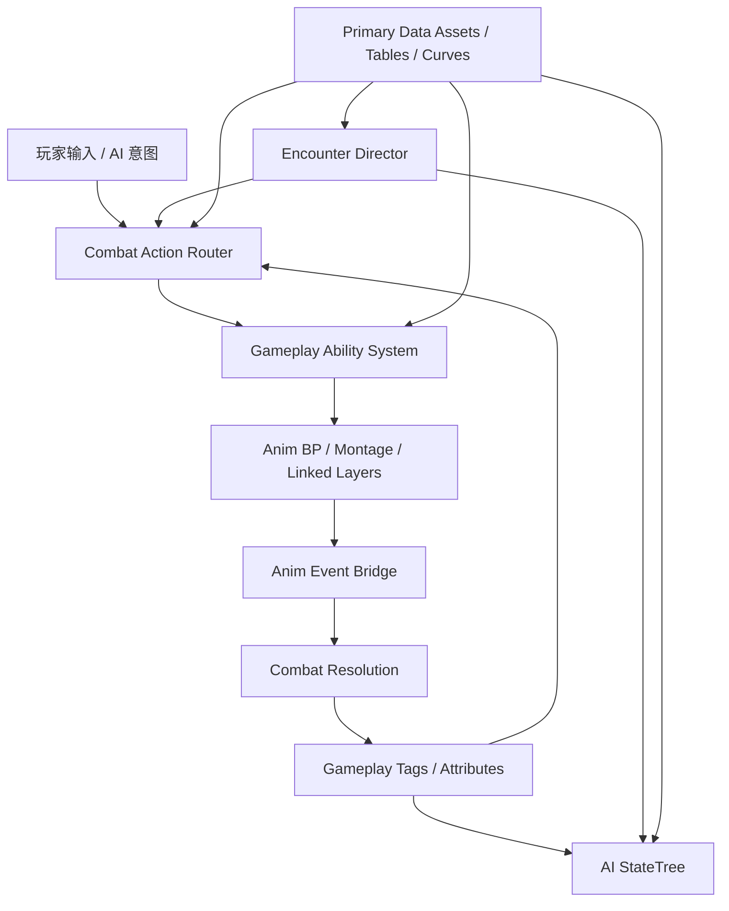

# UE5.7 类 Sekiro 动作游戏架构设计

## 1. 文档目标

本文给出一套面向 Unreal Engine 5.7 的类 Sekiro 第三人称动作游戏架构方案。

目标体验：

- 高精度近战
- 以架势条 / 格挡 / 弹反为核心的战斗循环
- 强调压迫、试探、惩罚、连段和 Boss 多阶段战斗
- 动画驱动的招式时序
- 数据驱动的敌人 AI、招式和数值配置

这不是 1:1 复刻 Sekiro，而是把它背后的“分层思路”翻译成 UE5.7 中更适合工程化落地的实现。

核心分层：

- 决策层
- 动作接线层
- 动画行为层
- 时间轴事件层
- 参数 / 配置层
- 遭遇战 / 事件层

---

## 2. 设计原则

### 2.1 代码负责规则，动画负责时序

动画负责：

- 某个事件在第几帧发生
- 动作什么时候进入可取消窗口
- 什么时候开攻击判定、开无敌、开弹反窗

代码负责：

- 当前动作是否合法
- 命中后要造成什么效果
- 架势、生命、硬直、击飞、无敌等规则如何结算

一句话：

**动画决定“什么时候”，系统决定“能不能”和“会发生什么”。**

### 2.2 保留 From 风格的职责边界

建议采用以下职责切分：

- AI 只负责“想做什么”
- 动作接线层负责“现在能不能做”
- Ability 负责“怎么执行这个动作契约”
- 动画系统负责“怎么播放和切换”
- 动画事件负责“这一刻触发什么”
- 战斗系统负责“命中、架势、伤害、反应怎么结算”
- 遭遇战系统负责“Boss 何时开战、换阶段、切场景状态”

### 2.3 先做单机，但边界要干净

本方案优先面向单机动作游戏。
不以联机同步为第一优先级。

但即便是单机，也要保持系统边界清晰：

- 输入不直接播动画
- AI 不直接播 Montage
- 动画不直接写死战斗逻辑

这样未来即使要扩展，也不会返工核心结构。

### 2.4 内容必须数据驱动

以下内容不要写死在零散 Blueprint 逻辑里：

- 敌人的距离偏好
- 招式表和分支关系
- 架势伤害和恢复曲线
- 取消窗口和输入缓冲策略
- Boss 阶段定义
- 镜头策略

这些应主要由：

- `Primary Data Asset`
- `Data Table`
- `Curve Table`
- `Gameplay Tags`

共同驱动。

---

## 3. UE5.7 能力映射

建议采用以下 UE 原生系统：

- `Enhanced Input`
  - 负责输入上下文、输入动作、战斗/探索/菜单切换
- `Gameplay Ability System (GAS)`
  - 负责动作执行、属性、效果、标签、打断和状态约束
- `Gameplay Tags`
  - 负责统一状态语言
- `StateTree`
  - 负责敌人高层决策和遭遇战逻辑
- `Motion Warping`
  - 负责处决、突进、抓取、贴身接触修正
- `Animation Notifies / Notify States`
  - 负责时间轴事件，承担类似 TAE 的职责
- `Asset Manager + Primary Data Asset`
  - 负责动作、敌人、Boss 阶段、镜头配置等数据资产管理

官方参考：

- [Enhanced Input](https://dev.epicgames.com/documentation/unreal-engine/enhanced-input-in-unreal-engine?lang=en-US)
- [Gameplay Ability System](https://dev.epicgames.com/documentation/unreal-engine/gameplay-ability-system-for-unreal-engine?lang=en-US)
- [Gameplay Tags](https://dev.epicgames.com/documentation/unreal-engine/using-gameplay-tags-in-unreal-engine?lang=en-US)
- [StateTree](https://dev.epicgames.com/documentation/unreal-engine/overview-of-state-tree-in-unreal-engine?lang=en-US)
- [Motion Warping](https://dev.epicgames.com/documentation/en-us/unreal-engine/motion-warping-in-unreal-engine)
- [Animation Notifies](https://dev.epicgames.com/documentation/unreal-engine/animation-notifies-in-unreal-engine?lang=en-US)
- [Asset Management](https://dev.epicgames.com/documentation/unreal-engine/asset-management-in-unreal-engine?lang=en-US)
- [Data Assets / Primary Data Asset](https://dev.epicgames.com/documentation/unreal-engine/data-assets-in-unreal-engine)

---

## 4. Sekiro 分层与 UE 实现对应关系

| Sekiro 风格概念 | 职责 | UE5.7 推荐实现 |
| --- | --- | --- |
| AI Lua / battle logic | 决策、距离控制、择招、连段、惩罚 | `StateTree` + `AIController` + 自定义 evaluator/task + 数据资产 |
| HKS / 动作接线 | 判断当前状态是否允许触发某动作 | `UCombatActionRouterComponent` + `Gameplay Tags` + 动作状态门控 |
| Behavior graph | 动作状态机、行为切换、动画组织 | `Anim Blueprint` + linked anim layer + state machine + montage |
| TAE | 帧事件、攻击判定、无敌、SFX、VFX、摄像机、投射物 | `AnimNotify` + `AnimNotifyState` + 动画事件桥 |
| Param | 数值、权重、架势、伤害、反应、技能参数 | `Primary Data Asset` + `Data Table` + `Curve Table` |
| EMEVD / 事件脚本 | Boss 开战、关门、换阶段、触发演出 | `Encounter Director` + `WorldSubsystem` + Trigger + 阶段资产 |

最重要的一条：

**不要让 AI 直接播动画。**

正确链路应该是：

AI 提交意图  
-> 动作接线层验证  
-> Ability 执行动作  
-> 动画播放  
-> 动画事件触发战斗时序  
-> 战斗系统做结算

---

## 5. 总体运行时架构



---

## 6. 模块划分

推荐源码模块：

```text
Source/
  GameCore/
  CombatRuntime/
  AnimationRuntime/
  AIRuntime/
  EncounterRuntime/
  UIRuntime/
  ToolsEditor/
```

### 6.1 `GameCore`

职责：

- 公共接口
- 全局 Tag 定义
- 公共数据结构
- GameInstance / Subsystem 注册
- 项目级配置

推荐类：

- `UGameCoreSubsystem`
- `UGameTagRegistry`
- `UGameProjectSettings`
- `ICombatant`
- `IActionSource`
- `ITargetable`

### 6.2 `CombatRuntime`

职责：

- 动作执行
- 伤害和架势结算
- 防御和反应
- 目标锁定
- 动作门控
- 输入缓冲和取消

推荐类：

- `ACombatCharacter`
- `UCombatAbilitySystemComponent`
- `UCombatAttributeSet`
- `UPostureAttributeSet`
- `UCombatActionRouterComponent`
- `UTargetingComponent`
- `UDefenseComponent`
- `UHitReactionComponent`
- `UCombatWindowComponent`

### 6.3 `AnimationRuntime`

职责：

- Locomotion 与上半身/下半身分层
- Montage 播放契约
- Motion Warping
- 动画事件桥接
- 动画元数据解释

推荐类：

- `UCombatAnimInstance`
- `UCombatLinkedAnimLayer`
- `UAnimNotify_GameplayEvent`
- `UAnimNotifyState_AttackWindow`
- `UAnimNotifyState_DeflectWindow`
- `UAnimNotifyState_IFrameWindow`
- `UAnimNotify_MotionWarpTarget`
- `UAnimEventBridgeComponent`

### 6.4 `AIRuntime`

职责：

- 敌人感知
- 高层战斗决策
- 择招和权重
- 距离维持
- 阶段战术切换

推荐类：

- `ACombatAIController`
- `UEnemyDecisionComponent`
- `UEnemyPerceptionComponent`
- `UEnemyTacticsComponent`
- 按敌人族群拆分的 `StateTree`

### 6.5 `EncounterRuntime`

职责：

- Boss 战开始/结束
- 场地开关
- 阶段切换
- UI 与音乐状态
- 奖励和检查点交接

推荐类：

- `AEncounterDirector`
- `UBossPhaseComponent`
- `UEncounterStateComponent`
- `UEncounterTriggerComponent`
- `UEncounterDefinitionData`

### 6.6 `ToolsEditor`

职责：

- 资产校验
- 动画事件审计
- 招式配置检查
- StateTree / Tag 一致性检查

推荐工具：

- Editor Utility Widget
- 自动化校验脚本
- Notify 使用规则校验器
- Gameplay Tag 规范检查器

---

## 7. 核心游戏框架

### 7.1 基础角色类

推荐统一基类：

- `ACombatCharacter : ACharacter, IAbilitySystemInterface`

基础职责：

- 持有 ASC
- 暴露当前目标
- 暴露角色动作状态
- 暴露骨骼、Socket、Trace 原点
- 暴露防御与受击接口

继承建议：

- `APlayerCombatCharacter`
- `AEnemyCombatCharacter`
- `ABossCombatCharacter`

不要一开始就拆成大量互不兼容的角色基类。
先稳定“战斗角色契约”，再通过组件和数据资产做差异化。

### 7.2 GAS 的使用范围

建议用 GAS 承载：

- 普攻 / 重击 / 突刺 / 危招
- 忍义手 / 技能 / 道具
- 受击 / 弹反 / 架势崩解
- 处决 / 暗杀 / 抓取 / 特殊反击
- Boss 特殊阶段动作

不建议用 GAS 承载：

- 每一个微小的 Locomotion 细节
- 纯视觉姿态切换
- 原始输入缓冲细节

判断标准：

- 这个动作是否有成本
- 是否可被打断
- 是否需要 Tag 门控
- 是否会产生 Gameplay Effect
- 是否需要统一执行契约

如果答案大多为“是”，那它就适合做成 `Gameplay Ability`。

### 7.3 `Gameplay Tags` 作为统一状态语言

推荐 Tag 体系：

```text
State.Combat
State.Attacking
State.Blocking
State.DeflectWindow
State.IFrame
State.Stunned
State.PostureBroken
State.Grappling
State.Execution
State.CannotRotate
State.CannotAttack
State.CannotGuard

Action.Attack.Light
Action.Attack.Heavy
Action.Attack.Thrust
Action.Attack.Sweep
Action.Attack.Grab
Action.Reaction.Hit
Action.Reaction.Deflect
Action.Reaction.PostureBreak
Action.Movement.Step
Action.Movement.Grapple

Damage.HP
Damage.Posture
Damage.Fire
Damage.Poison

AI.Mode.Passive
AI.Mode.Combat
AI.Mode.Recover
AI.Intent.Pressure
AI.Intent.Punish
AI.Intent.Reposition
AI.Intent.Deflect
```

这些 Tag 应该贯穿：

- Ability 门控
- AI 判断
- 动画事件
- UI 状态
- Boss 阶段系统

---

## 8. 最关键的一层：Combat Action Router

这一层是整个项目里最重要的部分，它相当于 UE 版本的“动作接线 / HKS 式门控层”。

### 8.1 为什么必须单独做这一层

如果让输入或 AI 直接播 Montage，项目很快会失控：

- 取消窗口四散在各处
- AI 和玩家走两套逻辑
- 连段分支难以统一
- 某些动作是否合法无法统一判断

所以必须有一个专门层来回答：

- 这个动作当前能不能发动
- 发动不了是拒绝还是排队
- 如果排队，什么时候释放
- 当前动作是否允许取消/派生
- 同一个动作请求，在不同状态下应落到哪个具体 Ability

### 8.2 推荐组件

- `UCombatActionRouterComponent`

### 8.3 主要职责

- 接收 `FCombatActionRequest`
- 把抽象动作请求解析成具体动作定义
- 检查 Required Tags / Blocked Tags
- 检查角色状态、移动模式、目标状态
- 检查当前是否在取消窗口、派生窗口、输入缓冲窗口
- 选择“拒绝 / 排队 / 立刻执行”
- 触发对应的 `Gameplay Ability`

### 8.4 玩家和 AI 走同一条执行链

不要给玩家一套逻辑，给 AI 另一套逻辑。
两者都应该向 Router 提交同一种请求：

```text
FCombatActionRequest
  ActionTag
  SourceType (Player / AI / Scripted)
  PreferredVariant
  TargetActor
  TargetPoint
  IntentStrength
  Timestamp
```

这样同一套系统就能承接：

- 玩家普攻
- 敌人择招
- Boss 转阶段动作
- 特殊反击动作

### 8.5 输入缓冲与取消体系

建议显式实现三件事：

- `Input Buffer`
- `Cancel Window`
- `Branch Rule`

推荐归属：

- 输入缓冲队列放在 `UCombatActionRouterComponent`
- 窗口开关由 `AnimNotifyState` 驱动
- 分支规则写在动作定义资产中

这一点决定后面项目会不会变成 Montage 地狱。

---

## 9. 战斗数据模型

### 9.1 属性设计

推荐属性：

- `Health`
- `MaxHealth`
- `Posture`
- `MaxPosture`
- `PostureRecoveryRate`
- `PostureRecoveryDelay`
- `AttackPower`
- `DefensePower`
- `GuardEfficiency`
- `PoiseToughness`
- `MoveSpeedScale`

可选属性：

- `PerilousResistance`
- `StealthDamageMultiplier`
- `ExecutionThreshold`

### 9.2 Effect 设计

推荐用 `Gameplay Effect` 表达：

- 生命伤害
- 架势伤害
- 持续 Buff / Debuff
- 架势恢复抑制
- 移动惩罚
- 临时霸体

### 9.3 命中结算链

建议流程：

1. 动画 Notify 打开攻击判定窗口
2. 武器 Trace / 角色体积检测命中目标
3. 命中解析器构建 `FCombatHitContext`
4. 防御系统判断结果：
   - 弹反
   - 普通格挡
   - 无敌规避
   - 霸体承受
   - 正常命中
5. 应用生命 / 架势 Gameplay Effect
6. 反应系统选择具体受击 Ability
7. 摄像机、音效、特效从结算结果统一触发

### 9.4 架势系统必须是一等公民

不要把架势简单理解成“另一条体力条”。

架势系统至少要单独管理：

- 累积
- 衰减延迟
- 衰减速度
- 崩解阈值
- 崩解状态持续时间
- 崩解后恢复保护
- 弹反后对双方的反馈规则

即便底层仍然使用 GAS，也建议给架势单独的结算路径和语义。

---

## 10. 动画架构

### 10.1 推荐切分

- 移动层：`Anim Blueprint` State Machine / Blend Space
- 承诺型动作：`Montage`
- 武器/敌人族群差异：`Linked Anim Layer`
- 贴身修正与对位：`Motion Warping`

### 10.2 为什么不要做一个超级大 Anim Blueprint

一旦把下面这些东西都塞进同一个 ABP，后期就会失控：

- 玩家普通移动和战斗移动
- 多种武器层
- 多种敌人反应
- Boss 特殊状态
- 暗杀 / 抓取 / 钩锁 / 处决 / 演出动作

更推荐：

- 一个基础战斗 `AnimInstance`
- 多个 linked layer 做武器/族群差异
- 通过 Montage 组织招式执行
- 通过动作元数据驱动共性规则

### 10.3 UE 中的 TAE 等价层：语义化 Notify

不要在每个动画里随手写零散 Blueprint Notify。
建议先定义统一的 Notify 语义体系。

推荐 Notify：

- `ANS_AttackWindow`
- `ANS_DeflectWindow`
- `ANS_IFrameWindow`
- `ANS_SuperArmorWindow`
- `ANS_InputBufferOpen`
- `ANS_CancelWindow`
- `AN_SpawnVFX`
- `AN_PlaySFX`
- `AN_CameraImpulse`
- `AN_ApplyMotionWarpTarget`
- `AN_SendGameplayEvent`
- `AN_SetLockRotation`
- `AN_SetMoveMode`
- `AN_SpawnProjectile`
- `AN_SetWeaponTrail`

### 10.4 Notify 统一桥接规则

所有 Notify 不要直接散落执行逻辑。
应统一进入：

- `UAnimEventBridgeComponent`

由它把动画事件翻译成：

- Gameplay Event
- Tag 开关
- HitBox 开关
- Camera / Audio / FX 请求

这样即使以后换动画，也不需要改一堆分散逻辑。

### 10.5 Motion Warping 的使用原则

适合用于：

- 类 Mikiri 的对位反击
- 处决
- 暗杀
- 抓取
- 长距离突进贴身
- 钩锁落点修正

不适合用于：

- 掩盖错误的动作设计
- 强行修复本来就不合理的距离系统

它应该是修正层，不是补锅层。

---

## 11. AI 架构

### 11.1 高层结构

推荐栈：

- `ACombatAIController`
- 感知组件
- 敌人上下文/知识组件
- `StateTree`
- `Combat Action Router`

AI 只负责“战术和意图”，不负责最后一步动作执行。

### 11.2 `StateTree` 结构建议

顶层状态：

```text
Idle
Patrol
Investigate
Search
Combat
Recover
Staggered
PostureBroken
Executionable
Dead
```

战斗子状态：

```text
EvaluateRange
MaintainSpacing
CircleTarget
PressureTarget
DeflectResponse
PunishHeal
SelectAttack
ChainAttack
RetreatAndRecover
UsePerilousMove
PhaseTransition
```

### 11.3 AI 数据资产拆分

建议至少拆两类资产。

#### `PDA_EnemyArchetype`

字段建议：

- 感知范围
- 偏好战斗距离
- 侵略性
- 惩罚倾向
- 允许使用的招式组
- 反应配置
- 架势配置
- 移动配置
- 阶段配置引用

#### `PDA_EnemyMoveSet`

字段建议：

- 可用 Move 列表
- 距离偏好
- 权重曲线
- 连段派生关系
- 冷却组
- 惩罚条件
- Required/Blocked Tags

这样 StateTree 只负责“怎么选”，而不是把所有数值和配置全塞进去。

### 11.4 AI 择招原则

不要简单写成：

- 距离小于 300 就永远出某招

更合理的是综合以下维度做加权：

- 当前距离区间
- 朝向角
- 最近使用过的动作
- 玩家当前架势
- 自身当前架势
- 玩家是否喝药 / 使用道具
- Boss 当前阶段
- 场地局部拥挤情况

这样既能保留设计控制，又不会让 AI 机械重复。

---

## 12. 玩家输入与控制架构

### 12.1 `Enhanced Input` 上下文

建议拆分：

- `IMC_Common`
- `IMC_Exploration`
- `IMC_Combat`
- `IMC_Grapple`
- `IMC_Menu`
- `IMC_CinematicRestricted`

### 12.2 输入链路

建议流程：

```text
Enhanced Input
-> Player Controller / Input Component
-> UPlayerCombatIntentComponent
-> UCombatActionRouterComponent
-> Gameplay Ability 激活
```

收益：

- 输入缓冲统一
- 可重绑定
- 玩家与 AI 契约一致
- 不在 Controller 中散落动画触发逻辑

### 12.3 锁定与镜头

建议尽量把目标锁定和镜头从角色类中剥离。

推荐组件：

- `UTargetingComponent`
- `UCombatCameraComponent`

职责：

- 目标搜索
- 切换锁定
- 丢锁判定
- Boss 镜头策略
- 战斗 FOV / 距离 / 偏移预设

推荐数据资产：

- `PDA_CameraCombatProfile`
- `PDA_CameraBossProfile`

---

## 13. 遭遇战与 Boss 架构

这一层对应 Sekiro 风格里的“事件脚本 / Boss 流程 / 场地控制”。

### 13.1 核心原则

尽量让地图脚本保持轻量。
可复用的战斗流程应沉淀到独立的遭遇战系统。

### 13.2 推荐结构

- `AEncounterDirector`
- `AEncounterVolume`
- `ABossStartTrigger`
- `UBossPhaseComponent`
- `PDA_EncounterDefinition`
- `PDA_BossPhaseDefinition`

### 13.3 遭遇战系统职责

- 玩家入场后开战
- 锁门 / 开门
- 切 BGM
- 打开 Boss UI
- 处理复活/检查点规则
- 切 Boss 阶段
- 控制增援和环境机关
- 发奖励和过场回调

### 13.4 Boss 阶段模型

每个阶段建议定义：

- 进入条件
- 启用的招式组
- 数值修正
- 反应配置覆盖
- 镜头配置覆盖
- 特殊演出 Ability
- 阶段结束条件

不要把 Boss 阶段逻辑散在：

- Anim Blueprint
- Level Blueprint
- AI task
- UI Widget

应由 Encounter 层统一持有真相。

---

## 14. 数据架构

### 14.1 什么放 Data Asset，什么放 Table

适合 `UPrimaryDataAsset` 的内容：

- 动作定义
- Ability Set
- 敌人原型
- Boss 阶段
- 遭遇战定义
- 反应配置
- 镜头配置

适合 `DataTable` / `CurveTable` 的内容：

- 纯数值配置
- 简单查表
- 恢复曲线
- 架势衰减曲线
- 加权曲线

### 14.2 推荐资产类型

#### `PDA_ActionDefinition`

字段建议：

- `ActionTag`
- `AbilityClass`
- `Montage`
- `LinkedAnimLayerOverride`
- 语义窗口定义
- `RequiredTags`
- `BlockedTags`
- 输入缓冲策略
- 可取消规则
- 消耗
- 锁定/目标要求
- MotionWarp 配置
- 命中配置引用

#### `PDA_HitProfile`

字段建议：

- 生命伤害
- 架势伤害
- 命中等级
- 格挡伤害
- 弹反反震规则
- 受击类别
- 元素效果

#### `PDA_ReactionProfile`

字段建议：

- 轻受击集
- 重受击集
- 架势崩解反应
- 墙反应
- 特殊硬直处理
- 霸体和打断规则

#### `PDA_EnemyArchetype`

字段建议：

- 移动配置
- 感知配置
- 距离偏好
- Moveset
- 防御配置
- 反应配置
- 阶段引用

#### `PDA_EncounterDefinition`

字段建议：

- 参与敌人列表
- 阶段序列
- 场地控制规则
- BGM 状态
- UI 状态
- 复活/检查点策略

### 14.3 `Asset Manager` 策略

建议把以下内容注册成 Primary Asset：

- `ActionDefinition`
- `EnemyArchetype`
- `EncounterDefinition`
- `BossPhaseDefinition`
- `AbilitySet`

收益：

- 加载更可控
- 引用更清晰
- Boss 战和大型遭遇战可做异步预加载
- 内容审计更方便

---

## 15. 推荐类蓝图

```text
ACombatCharacter
  - UCombatAbilitySystemComponent
  - UCombatAttributeSet
  - UPostureAttributeSet
  - UCombatActionRouterComponent
  - UTargetingComponent
  - UDefenseComponent
  - UHitReactionComponent
  - UAnimEventBridgeComponent
  - UCharacterStateComponent

APlayerCombatCharacter
  - UPlayerCombatIntentComponent
  - UCombatCameraComponent

AEnemyCombatCharacter
  - UEnemyDecisionComponent
  - UEnemyTacticsComponent

ACombatAIController
  - StateTree 引用
  - Perception Component
```

---

## 16. 三条最重要的运行时流程

### 16.1 敌人进攻流程

```text
StateTree 决定使用 Attack.Thrust.Mid
-> AI 生成 FCombatActionRequest
-> Action Router 校验距离、朝向、Tag、冷却
-> 激活 GA_Enemy_Thrust_01
-> Ability 播放 Montage 并提交动作状态
-> Notify 打开攻击判定窗口
-> 命中解析器判断格挡/弹反/命中结果
-> 施加生命与架势效果
-> 目标触发对应反应 Ability
-> AI 基于新状态继续决策
```

### 16.2 玩家弹反流程

```text
玩家在攻击将命中前输入防御
-> 输入进入 Action Router
-> 角色处于 Guard 或切入 Guard 状态
-> NotifyState 打开 DeflectWindow Tag
-> 来袭攻击进入防御结算
-> 若时机合法则判定为 Deflect
-> 攻击方受到反震 / 架势伤害 / 反应
-> 摄像机、音效、特效从结算结果统一触发
```

### 16.3 Boss 转阶段流程

```text
Boss 血量或架势满足阈值
-> Encounter Director 判断阶段切换条件
-> Router 暂时屏蔽常规动作
-> Boss 转阶段 Ability 执行
-> 演出 Montage / 特殊动画播放
-> Encounter 层切换招式组、数值和镜头配置
-> 恢复战斗
```

---

## 17. 内容目录建议

```text
Content/
  Characters/
    Common/
    Player/
    Enemies/
    Bosses/
  Animation/
    Base/
    Player/
    Enemies/
    Bosses/
    Notifies/
    MotionWarp/
  Abilities/
    Common/
    Player/
    Enemies/
    Bosses/
  AI/
    StateTrees/
    Tasks/
    Evaluators/
  Data/
    Actions/
    Enemies/
    Reactions/
    Encounters/
    Camera/
    Curves/
    Tables/
  UI/
  Audio/
  FX/
  Maps/
```

命名建议：

- `GA_`：Gameplay Ability
- `GE_`：Gameplay Effect
- `PDA_`：Primary Data Asset
- `ST_`：StateTree
- `ABP_`：Anim Blueprint
- `AN_` / `ANS_`：Anim Notify / Notify State

---

## 18. 研发落地路线

### Phase 0：竖切基础

目标：

- 一个玩家角色
- 一个人形敌人
- 一套架势 / 弹反 / 处决
- 一个小型 Boss 遭遇战

必须先做好的系统：

- Action Router
- GAS 核心
- 架势系统
- 动画事件桥
- 一个敌人 StateTree
- 一个 Encounter Director

### Phase 1：战斗扩展

扩展：

- 连段派生
- 危招
- 抓取
- 处决
- 更多反应类别
- 数据校验工具

### Phase 2：敌人多样化

扩展：

- 多个敌人族群
- 远近结合敌人
- 防御型敌人
- 精英怪 / 小 Boss
- 阶段配置复用模式

### Phase 3：Boss 与内容管线

扩展：

- 可复用 Boss 阶段框架
- 镜头配置工具
- 动画事件审计工具
- 内容侧平衡流程

---

## 19. 常见失败模式

### 19.1 AI 直接播 Montage

问题：

- AI 和动画耦合过深
- 玩家和敌人执行链不一致
- 连段和打断规则难统一

解决：

- 强制所有动作都走 `Action Router -> Ability -> Animation`

### 19.2 游戏逻辑散落在随机 Notify 里

问题：

- 难调试
- 难审计
- 动画一改就连带出错

解决：

- 统一 Notify 语义体系
- 所有 Notify 走 `UAnimEventBridgeComponent`

### 19.3 大量逻辑堆进 Blueprint Event Graph

问题：

- 难测试
- 难重构
- 难扩展到大量敌人和 Boss

解决：

- 契约放 C++
- Blueprint 主要负责组装和表现

### 19.4 架势系统做得太晚

问题：

- 防御和受击规则会非常混乱

解决：

- 从第一版竖切起就把架势当核心轴设计

### 19.5 Boss 阶段逻辑散落多处

问题：

- 每个 Boss 都变成一次性特例实现

解决：

- Encounter 层统一管理阶段真相

---

## 20. 最终建议

如果目标是“在 UE5.7 中做一个工程上可扩展的类 Sekiro 动作游戏”，最稳的组合是：

- `Enhanced Input` 负责输入意图
- `GAS + Gameplay Tags` 负责动作契约和战斗状态
- `Combat Action Router` 负责类似 HKS 的动作门控和接线
- `Anim Blueprint + Montage + Linked Anim Layers` 负责动作组织
- `Anim Notifies` 负责类似 TAE 的时间轴事件
- `Motion Warping` 负责贴身修正
- `StateTree` 负责敌人与遭遇战高层决策
- `Primary Data Assets + Asset Manager` 负责内容数据化
- `Encounter Director` 负责类似 EMEVD 的 Boss 流程和场地控制

整个项目最关键的不是“选哪个插件”，而是守住这条边界：

**意图选择、动作合法性判断、动作执行、动画播放、时间轴事件、战斗结算，必须是分开的系统。**

只要这个边界守住，项目可以扩展。
一旦这个边界塌掉，后面就会迅速变成 Montage + Blueprint 的维护灾难。

---

## 21. 最小可行核心（MVP）

如果你要先做一个结构正确的最小版本，建议只先做这些：

- `ACombatCharacter`
- `UCombatAbilitySystemComponent`
- `UCombatActionRouterComponent`
- `UDefenseComponent`
- `UAnimEventBridgeComponent`
- `UCombatAttributeSet`
- `UPostureAttributeSet`
- 一个玩家 `ABP`
- 一个敌人 `ABP`
- 一个敌人 `StateTree`
- 一个 `PDA_ActionDefinition`
- 一个 `PDA_EnemyArchetype`
- 一个 `AEncounterDirector`

所有复杂能力都应从这个核心向外扩展，而不是一开始就把系统铺得过大。

