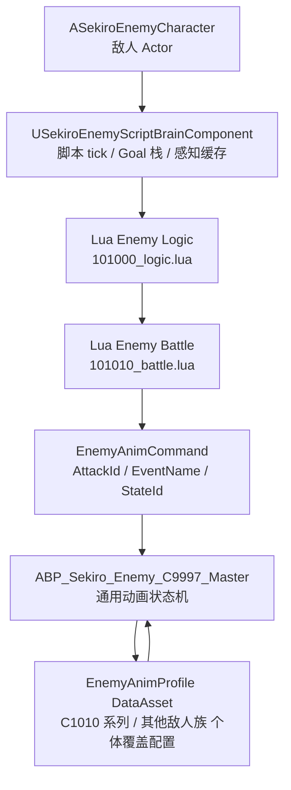
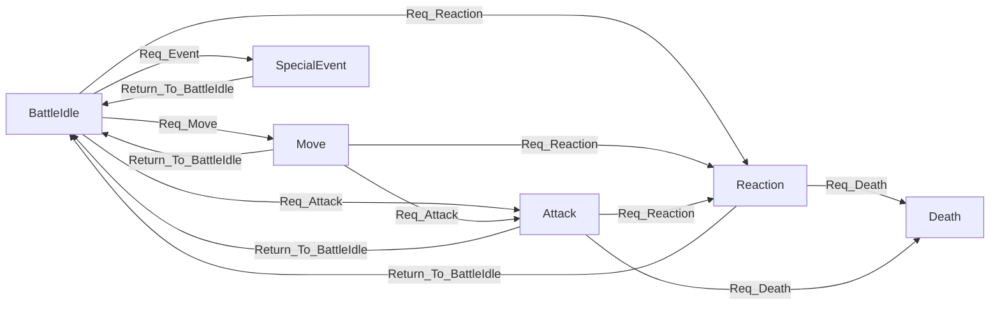

# UE 敌人通用动画状态机与 AI 脚本方案

> 目标：在 `SekiroDemo` 里实现一套接近只狼 `c9997 + c1010/c1011/c1012...` 的敌人结构。  
> `c9997` 对应 UE 侧的通用敌人动画状态机与通用行为层；`c1010/c1011/c1012` 对应每个敌人自己的配置资产、特殊状态和战斗脚本。
>
> 注意：只狼原版更准确地说是“`c9997` 通用行为图 + `cXXXX` 个体行为图/脚本/AI 表组合复用”，不是传统面向对象意义上的“子类覆盖父类所有参数”。UE 侧为了方便制作和调参，会把这种组合复用抽象成 `Base AnimBP + EnemyAnimProfile 覆盖配置`。

---

## 1. 设计原则

只狼敌人的核心不是“每个敌人一份完整状态机”，而是：

1. **共用底座**：`c9997.hkx` 承担移动、攻击、受击、破防、死亡、转身、后跳等大部分通用状态。
2. **个体补充**：`c1010.hkx` 只补自己的对话、演出、特殊状态；`101010_battle.dec.lua` 只改自己的战斗权重与动画 ID。
3. **动画 ID 做桥梁**：AI 不关心动画图内部结构，只发出 `AttackId/StateId/EventName`。
4. **表驱动**：行为差异来自配置表和权重表，而不是复制一份状态机后到处改蓝图。

UE 侧也按这个思路实现：



UE 侧的核心翻译关系：

| 原版概念 | UE 侧对应 | 说明 |
|---|---|---|
| `c9997.hkx.xml` | `ABP_Sekiro_Enemy_C9997_Master` | 通用状态机骨架，不绑定具体敌人倾向 |
| `cXXXX.hkx.xml` | `EnemyAnimProfile.SpecialEventMap` + 可选 `Linked Anim Layer` | 个体特殊状态、演出、对话 |
| `cXXXX.dec.lua` | `EnemyBehavior.lua` 或 Anim bridge callback | 每帧状态回调、通用反应入口 |
| `<id>_logic.dec.lua` | `Enemy Logic Lua` | Battle/Find/Caution、关卡事件、高优先级路由 |
| `<id>_battle.dec.lua` | `Enemy Battle Lua` | 距离权重、Act 表、冷却、空间检测 |
| `AI_EXCEL_*` / params | `EnemyCombatProfile` / `EnemySenseProfile` | 可调数值，不写死在脚本里 |

---

## 2. UE 资产分层

### 2.1 通用底座资产

建议新增：

| 资产 | 职责 |
|---|---|
| `/Game/Animation/Sekiro/Enemy/Common/ABP_Sekiro_Enemy_C9997_Master` | 通用敌人 AnimBP，复刻 `c9997` 的主干状态机 |
| `/Game/Animation/Sekiro/Enemy/Common/DA_EnemyAnimProfile_Base` | 默认动画映射、状态参数、事件名、曲线参数 |
| `/Game/Blueprints/Enemy/BP_SekiroEnemyBase` | 所有敌人的基类蓝图 |
| `/Game/AI/Enemy/DA_EnemyScriptRuntime_Default` | 脚本运行时配置：tick 频率、调试开关、脚本模块根路径 |
| `/Game/AI/Enemy/DA_EnemySenseProfile_Default` | 感知参数：视距、听觉、战斗进入/脱离阈值 |

通用 AnimBP 不直接写死某个落武者的招式，而是保留通用槽位：

- `Idle / Alert / BattleIdle`
- `MoveStart / MoveLoop / MoveStop`
- `Turn / QuickTurn`
- `Attack`
- `ComboAttack`
- `Step / SidewayMove / Backstep`
- `Guard / Deflect / Break`
- `HitReaction`
- `Death / NinsatsuDeath`
- `SpecialEvent`

### 2.2 个体覆盖资产

每种敌人只做自己的配置资产和少量特殊脚本：

| 敌人 | 动画配置 | AI logic | AI battle | 说明 |
|---|---|---|---|---|
| 落武者一手刀 | `DA_EnemyAnimProfile_C1010_OneHand` | `101000_logic.lua` | `101000_battle.lua` | 共用落武者 logic，战斗表不同 |
| 落武者八双 | `DA_EnemyAnimProfile_C1010_Hassou` | `101000_logic.lua` | `101010_battle.lua` | 同角色行为族，不同 battle 表 |
| 落武者枪 | `DA_EnemyAnimProfile_C1010_Spear` | `101000_logic.lua` | `101020_battle.lua` | 同底座，不同攻击映射与权重 |

蓝图实例只需要选择：

- `EnemyId`
- `LogicScript`
- `BattleScript`
- `AnimProfile`
- `CombatProfile`
- `PerceptionProfile`
- `TeamProfile`

### 2.3 运行时模块职责

建议把敌人运行时拆成几个小模块，避免 Actor、AI、动画、Lua 全挤在一个类里：

| 模块 | 类型 | 职责 |
|---|---|---|
| `ASekiroEnemyCharacter` | C++/BP Actor | Mesh、Movement、Hitbox、组件挂载、对外事件入口 |
| `ASekiroEnemyAIController` | C++/BP AIController | 只提供 Perception、NavMove、目标候选收集；不承载决策图 |
| `USekiroEnemyScriptBrainComponent` | ActorComponent | 敌人脚本大脑：Logic/Battle 调度、GoalStack、冷却、scratchpad |
| `USekiroEnemyAnimBridgeComponent` | ActorComponent | 接收 `EnemyAnimCommand`，写 AnimBP 变量，监听动画结束 |
| `USekiroEnemyEffectComponent` | ActorComponent | SpEffect/GameTag 状态、受击/破防/死亡事件 |
| `USekiroEnemyDebugComponent` | ActorComponent | 决策日志、权重表、当前状态可视化 |

推荐所有敌人实例都挂同一套组件，只通过 DataAsset 和 Lua 模块变化。这样之后加枪兵、火枪兵、喇叭手时，不需要改基类。

本方案明确不使用 UE 决策图或黑板承担敌人决策。`AIController` 只是脚本能调用的 UE 能力适配器，真正的“脑子”是 `USekiroEnemyScriptBrainComponent + Lua Logic/Battle`。

---

## 3. 敌人配置总表

建议新增一个总配置资产：`USekiroEnemyDefinition`。它是敌人实例真正选择的入口。

```cpp
UCLASS(BlueprintType)
class USekiroEnemyDefinition : public UDataAsset
{
    GENERATED_BODY()

public:
    UPROPERTY(EditAnywhere, BlueprintReadOnly)
    FName EnemyId;

    UPROPERTY(EditAnywhere, BlueprintReadOnly)
    FName EnemyCode;

    UPROPERTY(EditAnywhere, BlueprintReadOnly)
    TSoftObjectPtr<USkeletalMesh> Mesh;

    UPROPERTY(EditAnywhere, BlueprintReadOnly)
    TSoftObjectPtr<USekiroEnemyAnimProfile> AnimProfile;

    UPROPERTY(EditAnywhere, BlueprintReadOnly)
    TSoftObjectPtr<USekiroEnemyCombatProfile> CombatProfile;

    UPROPERTY(EditAnywhere, BlueprintReadOnly)
    TSoftObjectPtr<USekiroEnemySenseProfile> SenseProfile;

    UPROPERTY(EditAnywhere, BlueprintReadOnly)
    FString LogicScript;

    UPROPERTY(EditAnywhere, BlueprintReadOnly)
    FString BattleScript;
};
```

示例：

| Definition | EnemyId | EnemyCode | LogicScript | BattleScript | AnimProfile |
|---|---:|---|---|---|---|
| `DA_EnemyDef_101000_Ochimusha_OneHand` | `101000` | `C1010` | `Enemy/C1010/101000_logic` | `Enemy/C1010/101000_battle` | `DA_EnemyAnimProfile_C1010_OneHand` |
| `DA_EnemyDef_101010_Ochimusha_Hassou` | `101010` | `C1010` | `Enemy/C1010/101000_logic` | `Enemy/C1010/101010_battle` | `DA_EnemyAnimProfile_C1010_Hassou` |
| `DA_EnemyDef_101020_Ochimusha_Spear` | `101020` | `C1010` | `Enemy/C1010/101000_logic` | `Enemy/C1010/101020_battle` | `DA_EnemyAnimProfile_C1010_Spear` |

这里把 `C1010/C1011/C1012` 收敛成“EnemyCode/AnimProfile/BattleScript”的组合，不强求 UE 资产名完全等同原版角色编号。原版里 `101xxx` 是 AI 逻辑 ID，`c1010` 是角色行为资源编号，两者不要混成一个字段。

---

## 4. 动画配置数据结构

建议做一个 `UDataAsset`：`USekiroEnemyAnimProfile`。

核心字段：

```cpp
USTRUCT(BlueprintType)
struct FSekiroEnemyAnimStateDef
{
    GENERATED_BODY()

    UPROPERTY(EditAnywhere, BlueprintReadOnly)
    int32 StateId = 0;

    UPROPERTY(EditAnywhere, BlueprintReadOnly)
    FName StateName;

    UPROPERTY(EditAnywhere, BlueprintReadOnly)
    TObjectPtr<UAnimSequenceBase> Animation;

    UPROPERTY(EditAnywhere, BlueprintReadOnly)
    FName EnterEvent;

    UPROPERTY(EditAnywhere, BlueprintReadOnly)
    FName ExitEvent = "W_Idle";

    UPROPERTY(EditAnywhere, BlueprintReadOnly)
    float BlendIn = 0.08f;

    UPROPERTY(EditAnywhere, BlueprintReadOnly)
    float PlayRate = 1.0f;

    UPROPERTY(EditAnywhere, BlueprintReadOnly)
    bool bEnableRootMotion = true;
};
```

`USekiroEnemyAnimProfile` 建议包含：

| 字段 | 用途 |
|---|---|
| `EnemyCode` | `C1010 / C1011 / C1012` |
| `BaseProfile` | 父级配置，未覆盖字段从父级读取 |
| `StateMap` | `StateId -> FSekiroEnemyAnimStateDef` |
| `AttackMap` | `AttackId -> StateId` |
| `ReactionMap` | `ReactionType/SpEffect -> StateId` |
| `LocomotionSet` | 待机、走、跑、转身、侧步、后跳 |
| `MontageSlotMap` | 必要时把部分攻击走 Montage Slot |
| `EventAliases` | 兼容只狼事件名，如 `W_Idle`, `W_Event21001` |

覆盖规则：

```text
Resolve(StateId):
    if CurrentProfile.StateMap has StateId:
        return CurrentProfile.StateMap[StateId]
    else if BaseProfile exists:
        return BaseProfile.Resolve(StateId)
    else:
        return MissingStateFallback
```

这样 `DA_EnemyAnimProfile_Base` 就是 UE 版 `c9997` 的“可配置视图”；`DA_EnemyAnimProfile_C1010_Hassou` 只覆盖自己的攻击、对话、特殊演出。底层实现仍保持组合复用的语义：通用状态机负责流程，个体配置负责解析到哪条动画和哪些事件。

---

## 5. 通用 AnimBP 结构

`ABP_Sekiro_Enemy_C9997_Master` 建议保留“事件驱动 + StateId 选态”的风格，和当前 C0000 预览结构保持一致。

### 5.1 AnimBP 变量接口

| 变量 | 类型 | 来源 | 用途 |
|---|---|---|---|
| `EnemyStateId` | int | AI/动画桥 | 当前目标状态 ID |
| `EnemyAttackId` | int | Battle 脚本 | 当前攻击动画 ID |
| `EnemyEventName` | Name | 行为层 | 当前触发事件 |
| `EnemyLayer` | enum/int | 动画桥 | Base / Action / Reaction / Death |
| `MoveSpeedLevel` | int | Movement/AI | 站、走、跑 |
| `MoveDirection` | int/float | Movement/AI | 前后左右、角度 |
| `TargetDistance` | float | AI 感知缓存 | 调试和动画选择 |
| `Req_Attack` | bool pulse | AI | 进入攻击状态 |
| `Req_Reaction` | bool pulse | 伤害系统 | 进入受击/破防 |
| `Req_Event` | bool pulse | 关卡/对话 | 进入特殊事件状态 |
| `Return_To_BattleIdle` | bool pulse | 动画结束 | 返回战斗待机 |

脉冲变量仍交给类似 `AnimVarWriter` 的统一写入层处理，避免脚本到处直接写 AnimBP。

### 5.2 状态机主干



状态内部通过 `EnemyStateId` 或 `EnemyAttackId` 从 `AnimProfile` 解析动画：

- `Attack`：`EnemyAttackId -> StateId -> Animation`
- `Reaction`：`ReactionType/SpEffect -> StateId -> Animation`
- `SpecialEvent`：`EventName -> StateId -> Animation`

如果 UE 动态 Sequence Player 不够稳定，攻击层可先用 Montage Slot 承载；但状态机仍保留 `AttackId/StateId` 作为统一入口。

### 5.3 EnemyAnimCommand

AI 层不要直接写十几个 AnimBP 变量。统一先生成一个命令：

```cpp
UENUM(BlueprintType)
enum class ESekiroEnemyAnimCommandType : uint8
{
    None,
    Move,
    Attack,
    Reaction,
    SpecialEvent,
    Death
};

USTRUCT(BlueprintType)
struct FSekiroEnemyAnimCommand
{
    GENERATED_BODY()

    UPROPERTY(EditAnywhere, BlueprintReadWrite)
    ESekiroEnemyAnimCommandType Type = ESekiroEnemyAnimCommandType::None;

    UPROPERTY(EditAnywhere, BlueprintReadWrite)
    int32 AttackId = INDEX_NONE;

    UPROPERTY(EditAnywhere, BlueprintReadWrite)
    int32 StateId = INDEX_NONE;

    UPROPERTY(EditAnywhere, BlueprintReadWrite)
    FName EventName;

    UPROPERTY(EditAnywhere, BlueprintReadWrite)
    float ExpectedDuration = 0.0f;

    UPROPERTY(EditAnywhere, BlueprintReadWrite)
    bool bCanBeInterrupted = true;
};
```

`USekiroEnemyAnimBridgeComponent` 负责把它翻译成 AnimBP 变量：

```text
Attack command
    -> AnimProfile.ResolveAttack(AttackId)
    -> EnemyAttackId = AttackId
    -> EnemyStateId = Resolved.StateId
    -> EnemyLayer = Action
    -> pulse Req_Attack
```

这样 Lua、关卡脚本和调试命令以后都可以走同一个动画入口。

---

## 6. AI 脚本架构

AI 决策完全走脚本，不使用 UE 决策图或黑板。更贴近原版、也更方便调参的结构是：

```text
Content/Script/Sekiro/Enemy/
├── Common/
│   ├── AIContext.lua
│   ├── GoalStack.lua
│   ├── ScriptBrain.lua
│   ├── CommonLogic.lua
│   ├── CommonBattle.lua
│   ├── CommonSubGoals.lua
│   ├── Cooldown.lua
│   └── SpaceCheck.lua
├── C1010/
│   ├── 101000_logic.lua
│   ├── 101000_battle.lua
│   ├── 101010_battle.lua
│   └── 101020_battle.lua
└── Registry.lua
```

UE 侧 `AIController/Perception/NavMovement` 负责事实采集和执行能力：

- 视觉/听觉感知
- 目标选择
- 距离、角度、是否在背后
- NavMesh 可达性
- `MoveTo`
- 转向
- 动画命令下发
- 受击、死亡、架势破防等高优先级事件注入

这些能力通过 `ai` 对象暴露给 Lua。UE 不决定“下一步做什么”，只回答脚本问题并执行脚本下发的移动/动画命令。

Lua 侧负责“想做什么”：

- `Logic.Main`：高层路由，处理 Battle/Find/Caution、关卡事件、特殊状态。
- `Battle.Activate`：根据距离、状态、空间、冷却、队伍角色分配权重。
- `ActNN`：组合 `ApproachTarget / Attack / SidewayMove / LeaveTarget` 等 SubGoal。
- `Interrupt`：处理玩家死亡、忍杀、烟雾、受击、剑击反应。

### 6.1 UE 与 Lua 的接口

Lua 中暴露一个接近原版的 `ai` 对象：

| Lua API | UE 来源 |
|---|---|
| `ai:GetDist(TARGET_ENE_0)` | Actor 距离 |
| `ai:IsInsideTarget(target, dir, angle)` | 向量点乘/叉乘 |
| `ai:CheckDoesExistPath(target)` | Navigation System |
| `ai:HasSpecialEffectId(target, id)` | GameplayTag/Effect 状态 |
| `ai:GetHpRate(TARGET_SELF)` | Attribute/Health Component |
| `ai:GetRandam_Int(a,b)` | 随机流 |
| `ai:SetTimer(id, sec)` | ScriptBrain timer |
| `ai:IsFinishTimer(id)` | ScriptBrain timer |
| `ai:SetNumber(idx, value)` | per enemy scratchpad |
| `ai:SetStringIndexedNumber(name, value)` | per enemy scratchpad |
| `ai:AddTopGoal(goalId, life, ...)` | GoalStack push |
| `ai:Replanning()` | 清 GoalStack 后下一帧重算 |

`goal` 对象提供：

| Lua API | UE 行为 |
|---|---|
| `goal:AddSubGoal(GOAL_COMMON_ApproachTarget, ...)` | 发起 MoveTo/转向任务 |
| `goal:AddSubGoal(GOAL_COMMON_AttackTunableSpin, ..., attackId, ...)` | 写 `EnemyAttackId` 并触发 `Req_Attack` |
| `goal:AddSubGoal(GOAL_COMMON_SidewayMove, ...)` | 侧向 EQS/NavMove |
| `goal:ClearSubGoal()` | 中断当前动作 |

### 6.2 脚本主循环与 GoalStack

脚本主循环直接驱动敌人。第一阶段用一个简单 GoalStack：

```text
EnemyScriptBrainComponent.Tick
    -> RefreshContext
    -> CommonLogic.HighPrioritySetup
    -> if GoalStack empty or needs replanning:
           Logic.Main(ai)
    -> GoalStack.Tick(delta)
    -> AnimBridge.TickCommandState
```

AI 大状态：

| 状态 | 进入条件 | 行为 |
|---|---|---|
| `Idle` | 没有目标、没有巡逻请求 | 原地待机或执行场景事件 |
| `Caution` | 听到声音/看见可疑点 | 看向、走近调查 |
| `Find` | 发现玩家但还未进入战斗距离或战斗锁定 | 追击、呼叫、转向 |
| `Battle` | 有有效战斗目标 | 调用 battle 脚本选 Act |
| `Event` | 关卡事件请求 | 事件 MoveTo 或特殊动画 |
| `Dead` | 生命值归零/忍杀完成 | 终止 GoalStack |

第一阶段可只做 `Idle/Battle/Dead`，接口预留其余状态。

### 6.3 SubGoal 最小集合

优先实现这些 `GOAL_COMMON_*`，够支撑落武者小兵：

| SubGoal | UE 执行 |
|---|---|
| `GOAL_COMMON_Wait` | 等待指定秒数 |
| `GOAL_COMMON_Turn` | 朝目标转向 |
| `GOAL_COMMON_ApproachTarget` | 脚本调用 NavMove 适配器，内部可用 `AIController::MoveToActor/Location` |
| `GOAL_COMMON_LeaveTarget` | 反方向移动 |
| `GOAL_COMMON_SidewayMove` | 侧向寻点 + MoveTo |
| `GOAL_COMMON_AttackTunableSpin` | 下发 Attack command，可在起手阶段转向 |
| `GOAL_COMMON_ComboAttackTunableSpin` | 下发第一段 Attack command，记录 combo continuation |
| `GOAL_COMMON_ComboFinal` | 前一段结束后下发最终 Attack command |

先不做完整 `Approach_Act_Flex` 的所有参数，第一版只保留：

```lua
Approach_Act_Flex(ai, goal, stop_dist, walk_dist, run_dist, odds_guard)
```

后续再补防御移动、强制跑、角度限制。

---

## 7. Battle 表设计

Battle 脚本照搬“权重槽位 + Act 函数”模式。

```lua
local Battle = {}

function Battle.Activate(ai, goal)
    local probabilities = {}
    local acts = {}

    local dist = ai:GetDist(TARGET_ENE_0)

    if ai:HasSpecialEffectId(TARGET_ENE_0, 3170200) then
        probabilities[25] = 1000 -- 后撤
    elseif dist >= 700 then
        probabilities[2] = 200   -- 突进斩
        probabilities[23] = 600  -- 侧步观察
    elseif dist >= 300 then
        probabilities[1] = 100
        probabilities[6] = 300
        probabilities[23] = 800
    else
        probabilities[1] = 200
        probabilities[6] = 400
    end

    probabilities[1] = CommonBattle.SetCoolTime(ai, goal, 3000, 5.0, probabilities[1])
    probabilities[6] = CommonBattle.SetCoolTime(ai, goal, 3007, 8.0, probabilities[6])

    acts[1] = Battle.Act01
    acts[2] = Battle.Act02
    acts[6] = Battle.Act06
    acts[23] = Battle.Act23
    acts[25] = Battle.Act25

    return CommonBattle.Activate(ai, goal, probabilities, acts, Battle.ActAfter_AdjustSpace)
end

function Battle.Act01(ai, goal)
    CommonSubGoals.Approach_Act_Flex(ai, goal, 320, 220, 450, 100)
    goal:AddSubGoal(GOAL_COMMON_AttackTunableSpin, 10, 3000, TARGET_ENE_0, 9999, 0, 0)
    return 100
end

return Battle
```

单位建议：

- Lua 决策层用厘米，和 UE 世界单位一致。
- 文档引用原版距离时注明换算。
- `AttackId` 保留原始编号，例如 `3000/3007/3050`，方便对照脚本文档。

### 7.1 CombatProfile

`USekiroEnemyCombatProfile` 存战斗数值，不把数值散落在 Lua 里：

| 字段 | 用途 |
|---|---|
| `BattleRadiusCm` | 进入战斗距离 |
| `LoseTargetRadiusCm` | 丢失目标距离 |
| `PreferredDistanceCm` | 倾向保持距离 |
| `AttackCooldowns` | `AttackId -> CooldownSeconds` |
| `ActRateOverrides` | `ActNN -> Rate` |
| `PhaseRules` | 血量/架势/忍杀阶段切换 |
| `bCanGuard` | 是否使用防御 |
| `bCanKengeki` | 是否使用剑击反应 |

Lua 里读取：

```lua
local rate = ai:GetActRate(6)       -- 来自 CombatProfile.ActRateOverrides
local cd = ai:GetAttackCooldown(3007)
probabilities[6] = probabilities[6] * rate
probabilities[6] = CommonBattle.SetCoolTime(ai, goal, 3007, cd, probabilities[6])
```

这样设计师调倾向不用改 Lua 文件。

---

## 8. 配置示例：C1010 系列

> 下表里的 `C1010` 指角色行为/动画族；`101000/101010/101020` 指 AI/battle 变体。UE 资产可以用更可读的后缀表达武器差异。

### 8.1 C1010 一手刀

| 项 | 配置 |
|---|---|
| `LogicScript` | `C1010/101000_logic.lua` |
| `BattleScript` | `C1010/101000_battle.lua` |
| `AnimProfile` | `DA_EnemyAnimProfile_C1010_OneHand` |
| 战斗倾向 | 中距离接近，近距离普通斩与侧步 |

### 8.2 C1010 八双

| 项 | 配置 |
|---|---|
| `LogicScript` | `C1010/101000_logic.lua` |
| `BattleScript` | `C1010/101010_battle.lua` |
| `AnimProfile` | `DA_EnemyAnimProfile_C1010_Hassou` |
| 战斗倾向 | 更高侧步权重，近距离连段更积极 |

### 8.3 C1010 枪

| 项 | 配置 |
|---|---|
| `LogicScript` | `C1010/101000_logic.lua` |
| `BattleScript` | `C1010/101020_battle.lua` |
| `AnimProfile` | `DA_EnemyAnimProfile_C1010_Spear` |
| 战斗倾向 | 中远距离突刺、保持距离、少贴身连段 |

这三者共用 `ABP_Sekiro_Enemy_C9997_Master`。如果某个敌人有专属演出，只在自己的 `AnimProfile.SpecialEventMap` 或可选 `Linked Anim Layer` 中覆盖，不复制整张通用状态机。

---

## 9. 高优先级事件与反应

参考 `COMMON_HiPrioritySetup`，UE 侧统一做一个 `USekiroEnemyHighPriorityRouter` 或 Lua `CommonLogic.HighPrioritySetup(ai)`。

优先级建议：

1. 死亡、忍杀、坠落死亡
2. 被处决态、破防态
3. 受击硬直、弹反、剑击反应
4. 玩家死亡、玩家复活
5. 烟雾、火焰、恐惧、傀儡咒
6. 关卡事件请求
7. 普通 Battle/Find/Caution

反应不是写在每个 battle 脚本里，而是通过通用入口：

```text
Damage/Effect System
    -> EnemyScriptBrainComponent: PushInterrupt(Event)
    -> CommonLogic.HighPrioritySetup
    -> EnemyAnimCommand(StateId/ReactionType)
    -> ABP Reaction layer
```

剑击反应 `Kengeki` 可作为 `Battle.Kengeki_Activate(ai, goal)` 的可选函数。没有实现该函数的敌人使用通用受击/防御反应。

### 9.1 中断规则

中断事件进入时按优先级处理：

```text
PushInterrupt(Death)
    -> ClearSubGoal
    -> AnimCommand Death
    -> AI state Dead

PushInterrupt(HitReaction)
    -> if current command can interrupt:
           ClearSubGoal
           AnimCommand Reaction
       else:
           queue pending reaction or ignore

PushInterrupt(Kengeki)
    -> if Battle has Kengeki_Activate:
           Battle.Kengeki_Activate(ai, goal)
       else:
           Common reaction
```

这里的关键是让 `AnimCommand.bCanBeInterrupted` 参与判断。比如普通斩可被受击中断，死亡总是可中断，忍杀演出通常不可被普通受击打断。

---

## 10. 调试工具

必须做可视化调试，否则权重表很难调。

建议每个敌人运行时输出：

- 当前 `EnemyId / LogicScript / BattleScript / AnimProfile`
- 当前 AI 状态：`Caution / Find / Battle`
- 当前目标距离、角度、是否可寻路
- 当前 Goal 栈
- 最近一次 `probabilities[N]` 分布
- 被选中的 `ActNN`
- 下发的 `AttackId / StateId / EventName`
- 当前 AnimBP 层和状态
- 冷却表

编辑器内可以做一个简单 `WBP_EnemyAIDebugPanel`，或者先用 `PrintString/UnLua.Log` 输出。

---

## 11. 推荐实现顺序

1. **数据资产先行**  
   建 `USekiroEnemyAnimProfile`，先填 `Base + C1010_Hassou` 的少量动画映射。

2. **敌人基类与动画桥**  
   建 `ASekiroEnemyCharacter`、`USekiroEnemyScriptBrainComponent`、`USekiroEnemyAnimBridge`，先能触发 `AttackId=3000` 播放并返回待机。

3. **通用 AnimBP 最小闭环**  
   `BattleIdle -> Attack -> BattleIdle`、`BattleIdle -> Move -> BattleIdle`、`Any -> Reaction`。

4. **Lua AI 最小闭环**  
   实现 `AIContext / GoalStack / CommonBattle / 101010_battle.lua`，先按距离选择 `Act01/Act06/Act23`。

5. **扩展 C1010 其他武器变体**  
   不复制 AnimBP，只新增 `AnimProfile` 和 battle 脚本。

6. **补高优先级事件**  
   受击、死亡、破防、玩家死亡/复活、烟雾等统一接入。

7. **补调试面板与记录**  
   每次决策记录权重表，方便对照 `docs/doc/dev/enemy` 的分析文档调参。

### 11.1 第一阶段最小闭环任务

第一阶段只追求“一种落武者能打起来，并且可通过配置换出另一个变体”：

| 步骤 | 产物 | 通过标准 |
|---|---|---|
| 1 | `USekiroEnemyDefinition` | BP 敌人实例能选择 Definition |
| 2 | `USekiroEnemyAnimProfile` | `AttackId=3000` 能解析到动画资源 |
| 3 | `ABP_Sekiro_Enemy_C9997_Master` 最小版 | `BattleIdle -> Attack -> BattleIdle` 成立 |
| 4 | `USekiroEnemyAnimBridgeComponent` | C++/Lua 发 Attack command 可驱动 AnimBP |
| 5 | `USekiroEnemyScriptBrainComponent` + Lua Registry | 能加载 `101010_battle.lua` |
| 6 | `GOAL_COMMON_AttackTunableSpin` | AI 选中 Act 后能播放攻击 |
| 7 | `GOAL_COMMON_ApproachTarget` | 超出距离时先接近再攻击 |
| 8 | Debug log | 能打印距离、权重表、Act、AttackId |

---

## 12. 不建议的做法

- 不建议每个敌人复制一份 AnimBP。短期快，后期任何受击/死亡/移动修正都要改多份。
- 不建议把所有距离权重写在 UE 可视化 AI 节点里。只狼这种 `Act01..Act50` 权重表更适合 Lua/DataAsset。
- 不建议让 AnimBP 自己做 AI 决策。AnimBP 只消费 `StateId/AttackId/EventName`。
- 不建议一开始复刻完整 `c9997`。先做最小闭环，再逐步补状态。
- 不建议把原版 `c1010/c1011/c1012` 编号直接当作唯一分类。UE 侧应区分 `EnemyId`、`EnemyCode`、`BattleScript`、`AnimProfile`，否则后面会把 AI 编号和角色资源编号混在一起。

---

## 13. 验收标准

第一阶段完成时，应满足：

- 同一个 `ABP_Sekiro_Enemy_C9997_Master` 可被至少两个敌人配置复用。
- 切换 `AnimProfile` 后，同一个 `AttackId=3000` 能解析到不同敌人的动画资源。
- 切换 `BattleScript` 后，敌人的距离权重和出招倾向发生变化。
- AI 脚本只下发 `AttackId/StateId/EventName`，不直接操作 AnimGraph 内部状态。
- 受击/死亡可从任意动作中断进入通用 Reaction/Death。
- 调试日志能看到本帧权重表、选中的 `ActNN`、最终动画命令。

---

## 14. 和现有文档的对应关系

- `AI_Script_Framework.md` 中的 `COMMON_EzSetup / Common_Battle_Activate / GOAL_COMMON_*`  
  对应 UE 侧 `CommonLogic.lua / CommonBattle.lua / CommonSubGoals.lua`。

- `c1010_Architecture.md` 中的 `c9997.hkx.xml`  
  对应 UE 侧 `ABP_Sekiro_Enemy_C9997_Master + DA_EnemyAnimProfile_Base`。

- `c1010_Architecture.md` 中的 `c1010.hkx.xml`  
  对应 UE 侧 `DA_EnemyAnimProfile_C101x_*` 的特殊状态覆盖，必要时再补 `Linked Anim Layer`。

- 当前 C0000 预览里的 `PreviewCharacter.lua -> FireEventHandlers -> AnimVarWriter -> AnimBP 变量`  
  对应敌人侧 `EnemyScriptBrainComponent/Lua Battle -> EnemyAnimBridge -> AnimBP 变量`。
