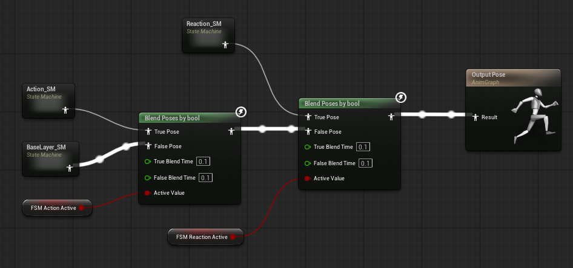
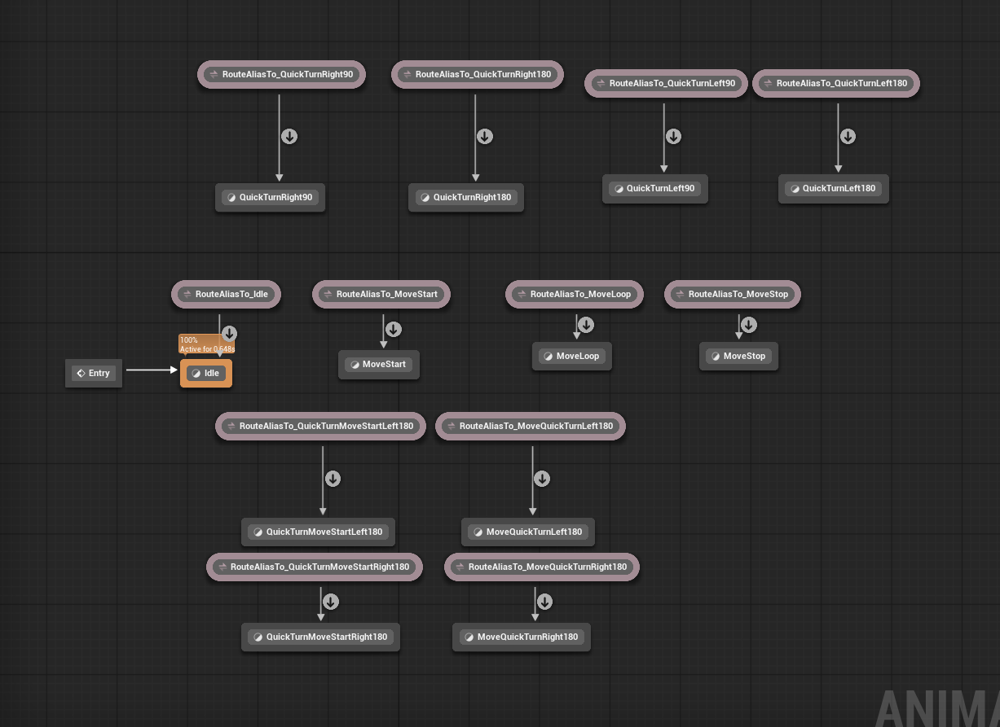
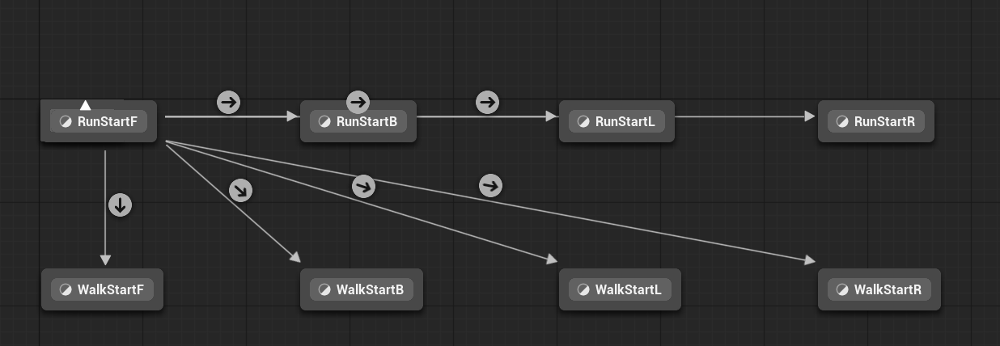
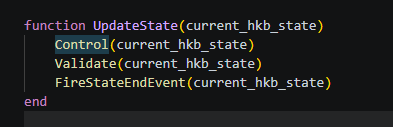
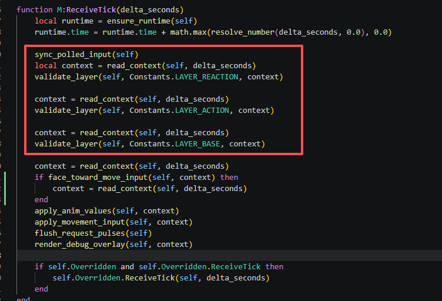
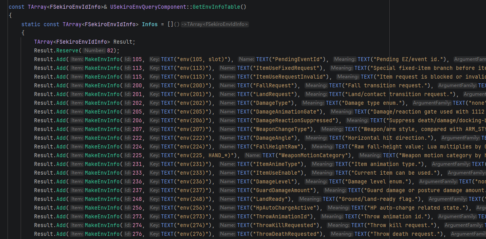
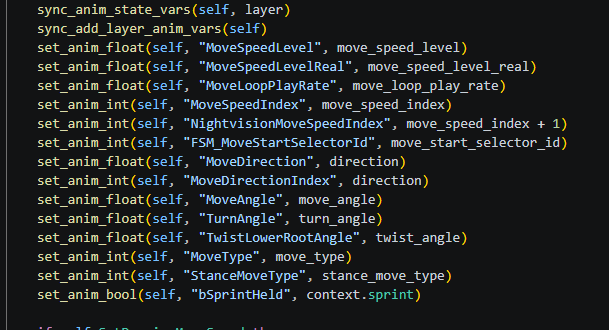

## 本周进展
   - UE内进展  
   UE内置lua脚本系统，仿照只狼动画控制脚本，制作了八方向移动逻辑, 动画丝滑度还需完善
## 动画状态机设计梳理
1. 动画状态机参照只狼的设置分Style和State，Layer，避免状态机太乱，可以根据不同的Style在内部进行状态筛选  
   - **Style**:常态，战斗姿态，居合，倒地等    
   - **State**: Idle, Run, Walk，TurnLeft90等  
   - **Layer**: 上半身（持刀，挥刀，格挡 ），下半身(走，跑，原地转身)，附加层(披风挂件，武器)  

2. 最上层所有的状态又分为Action（主动反应）和Reaction（被动反应），reaction优先级更高，被动反应可以打断主动动作，比如说被击飞打断攻击
 
## UE内状态机设计
1. 设计了Reaction，Action,和Base，默认是执行Base，Reaction和Action暂时空置

2. Base层里面目前只有常态
 
3. 具体状态下面设计了selector选择不同朝向的动画
   
   根据不同的朝向输入选择移动启动动画, 这些节点内部暂时还未实现上下半身分层动画
## 动画蓝图C++和lua动画变量交互设计
1. 只狼状态更新
   
   其中的Control将决定当前状态属于哪个抽象姿态(style)
   Validate决定里面执行是Action还是Reaction还是base
2. 仿照只狼处理动画变量
 
## Lua和C++之间关于动画变量的交互
C++端定义一堆变量查询，这个是根据现有资料猜测的变量

Lua端通过env(105)即可查询这个变量值  
Lua端通过更新这些数据可以改变C++端动画蓝图变量
只狼的设计是将不同的状态切换条件按照[style][state]来存储，根据引擎内部触发不同的条件查询不同的env变量，查询出切换条件，会设置到C++这边来切换动画状态。  
## 下周目标
- 简化移动动画状态机
- 还原只狼的移动事件触发逻辑，还原移动丝滑度
