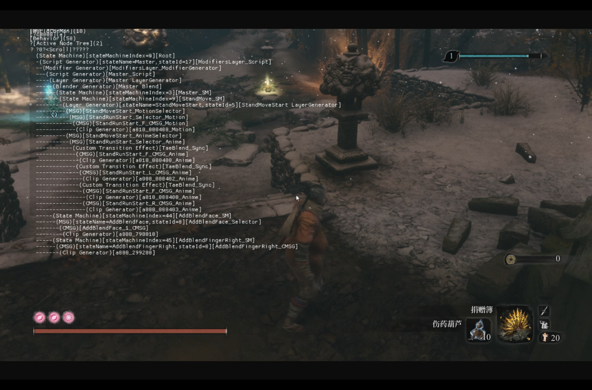
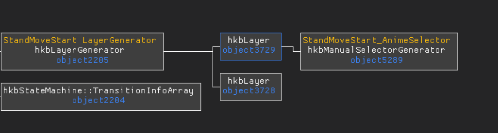
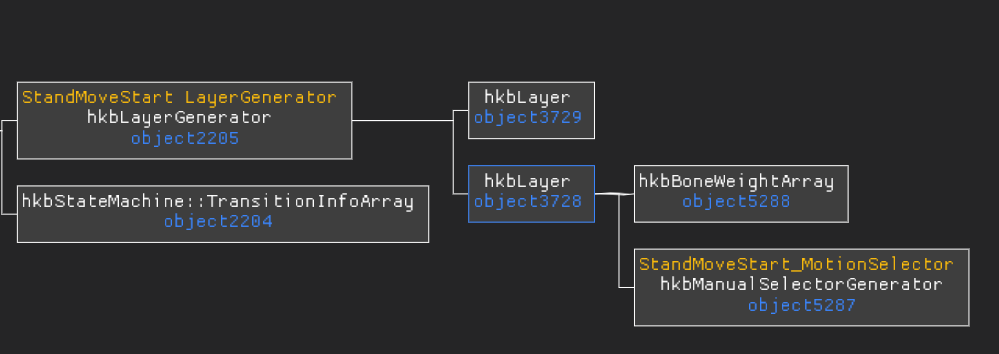
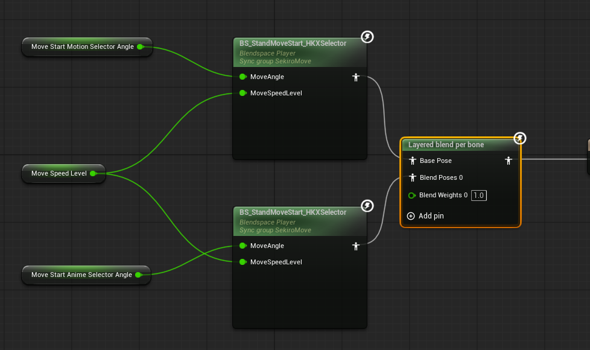

## 本周进展
- UE内状态机优化，减少大部分状态间切换逻辑，玩家可以顺畅起跑停，45度，90度，180度转向。135度转向逻辑还需完善，连续转向逻辑还需完善。
## 状态切换分析
根据实机操作视频，逐帧分析在转向过程中，动画状态的切换链。

比如角色在按下D键后右转，可以在视频中看到当前动作是什么动画状态

逐帧分析后能够获得这个过程动画经历了哪些状态，每个状态持续多长时间，然后在lua脚本这边用AI工具来实现对应状态的切换。
## Motion/Anime双层设计

在只狼原工程里面会对绝大多数状态分层设计，一个Motion层控制运动方向，一个Anime层控制可见姿势，这两层里面用的动画也是完全一致的，所以在UE这边则通过两个同样的BlendSpace来模拟这种设计
## 下周计划
- 实现lua脚本的原工程迁移使用，尽量复用原工程脚本逻辑。完成角色的各种移动操作，以及改善动画流畅性。