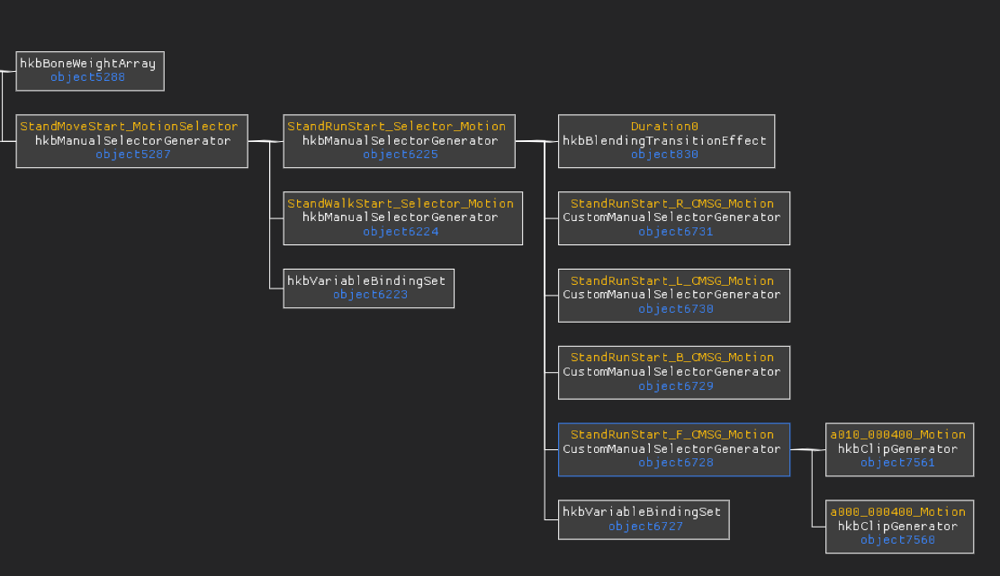
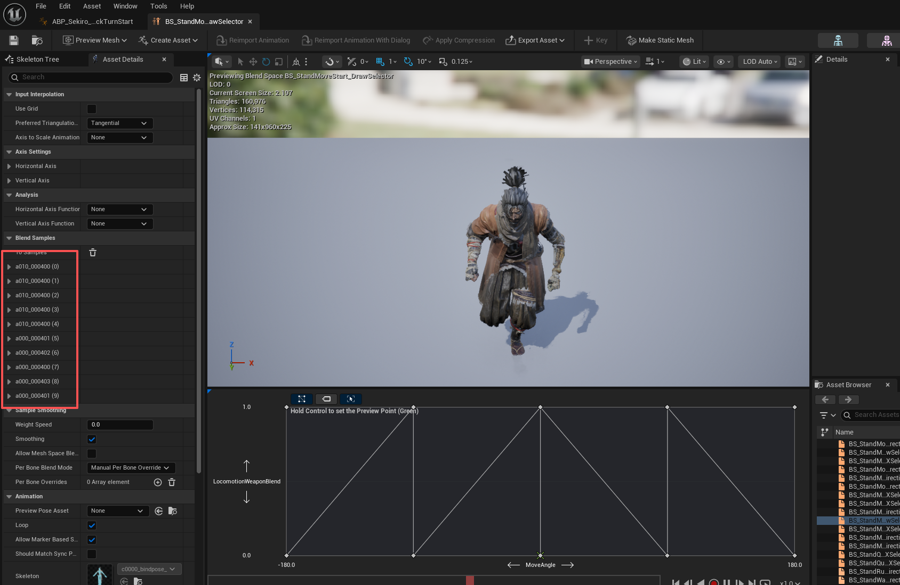

## 本周进展
- UE内角色各方向移动已完成，并且给角色添加上了武器，进入一定区域角色会拔刀，拔刀前和拔刀后角色起跑是两套动画。
## 接入只狼原生脚本
利用原生只狼的脚步来驱动动画状态机，我们只需要做一个桥接层，这个桥接层是给AI使用来修改env变量，原生脚本通过查询env变量的改变来切换动画状态机，根据AI分析的状态切换顺序，以及查询到只狼原工程里面的动画轨道事件来更改env变量。
## 装载武器状态
参考HKX动画状态机这边的实现，UE这边根据角色是否拔刀，以及角色的朝向，挑选不同的起步和跑步动画

HKX这边是5个动画，R/L/B三个朝向+持刀/未持刀的前向动画
UE这边的实现，也是用了5个动画资产，实现和HKX一样的效果

同理，跑步的动画也是类似的实现

## 下周计划
开始制作角色三段式普攻效果，连击效果，在第一个动作触发后，指定时间窗口内根据是否有按键输入绝对是否触发第二段攻击