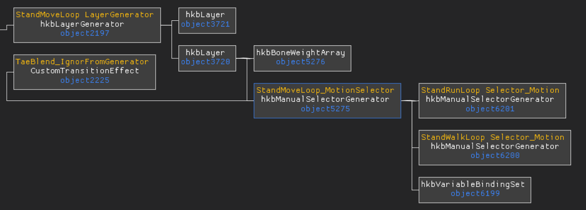
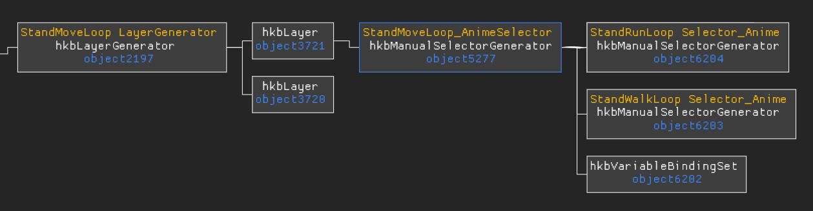
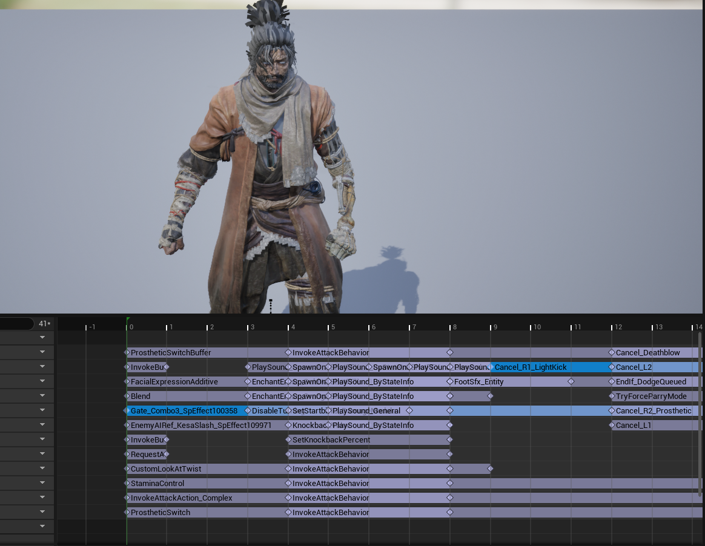

## 本周进展
- 完成普攻五段式连招攻击动作，防御姿态动作，并对代码结构进行优化。
## 对rootmotion资源的整合
Havok引擎这边动画资产的姿态和rootmotion移动是分开存储的，在DSA动画工具预览的时候会把两种文件结合起来，因此预览时看起来是正常的。UE这边的攻击动作需要用到rootmotion动画来达到相应的效果，在导入到UE的时候就要把rootmotion数据合并到动画资产里面。

在Havok里面通过Layer来自由的选择动画姿态和rootmotion，这就是只狼把动画和root位移分开存储的灵活性。
## 窗口事件还原
通过R1窗口取消事件和门事件，可以达成在窗口时间内输入触发下一次攻击逻辑

比如在这个动画里面的Gate_Combo3_SpEffect100358事件可以指定这个动画如果连击下一个动画是什么，然后在Cancel_R1_RightKick这个R1窗口取消事件里面有输入，就可以取消掉当前动画，切换进下一个动作，按照这种设计就能制作出来连招系统。
## 下周计划
- 完善动画事件系统，现有一些事件未实现，并且配置不方便需要每个动画单独配置。
- 捋顺敌人AI系统，战斗系统逻辑