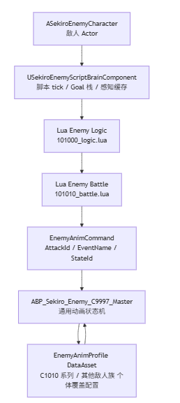
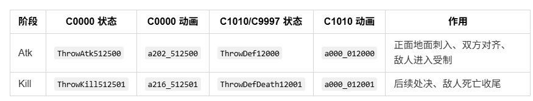

本周进展
- 资产导入工具处理动画事件同步导入，完成敌人基本的行走攻击受击死亡动作，主角通过帧事件创建碰撞体hitbox给敌人造成伤害，主角索敌策略添加，完成简单的主角攻击，敌人受击死亡效果。
## 参考只狼设计敌人小兵
### 动画资产分层
- 设计通用状态机，参考的C9997.hkx，包括通用的移动，攻击，受击，破防，死亡，转身，后跳等通用状态
- 个体补充，在只狼这边是用c1010.hkx状态机来针对个体小兵的特殊状态进行设计，包括对话，演出，特殊状态，在UE这边则是通过配置来修改行为差异，比如攻击半径，武器，外观，冷却时间等都可以通过配置来实现个体设计

### 忍杀分段设计
- 敌人血量处于低值时，主角触发忍杀处决敌人效果，分为主角和敌人两方，每一方都分成Atk和kill两个阶段，不做成一个阶段是因为主角忍杀的刺入和拔出过程是可以被打断的，敌人的被刺入和死亡也不是强关联的

主角正面忍杀先进入ThrowAtk状态用刀刺入敌人身体，敌人则进入ThrowDef受刺状态，判断刺入成功主角就可以进入ThrowKill拔刀，判断敌人死亡则进入ThrowDefDeath，这就是为什么忍杀这个动作要分段设计，因为主角不一定能刺入成功，敌人也不一定会死。
# 下周计划
- 完善敌人AI逻辑，包括完整的巡逻和攻击逻辑，完善敌人的攻击动画
- 完善忍杀动作，主角要精准刺入敌人体内