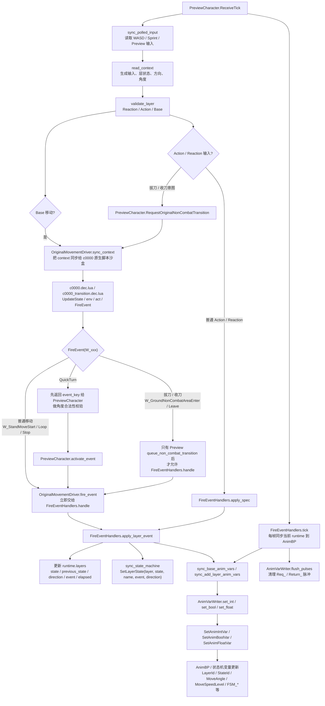
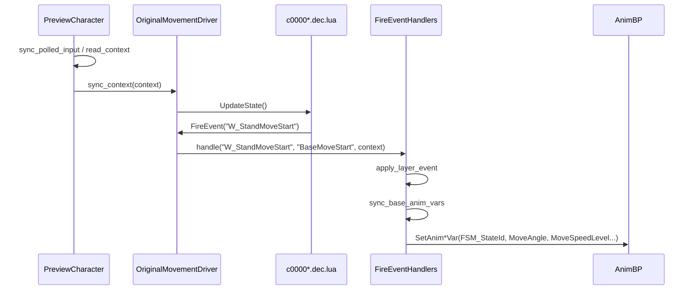
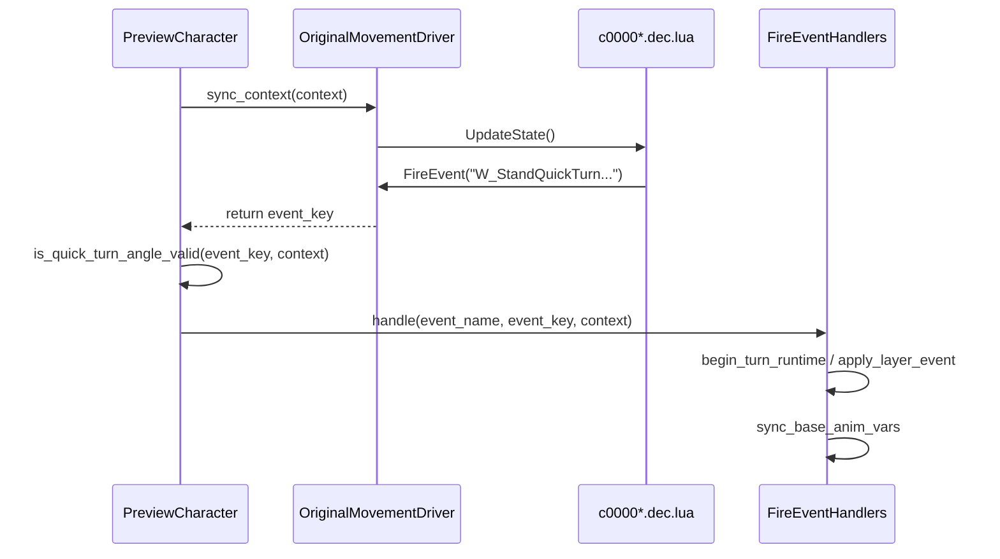
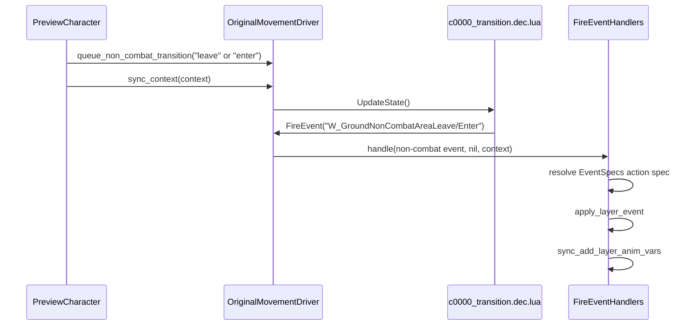

# PreviewCharacter 到动画状态机变量写入流程

本文记录当前 `PreviewCharacter.lua` 从输入/触发意图开始，到最终修改动画状态机和 AnimBP 变量的主链路。

## 总览

当前结构的核心目标是让 `PreviewCharacter` 只负责读取输入和触发意图；状态切换、`W_xxx` 事件处理、动画变量写入集中到 `OriginalMovementDriver`、`FireEventHandlers` 和 `AnimVarWriter`。

## 职责划分

### PreviewCharacter.lua

- 读取输入：`sync_polled_input`
- 构造当前帧上下文：`read_context`
- 执行层校验：`validate_layer`
- 对 quick-turn 事件做输入角度合法性校验
- 对拔刀/收刀只发起 `queue_non_combat_transition`
- 每帧调用 `FireEventHandlers.tick(self, context)`

`PreviewCharacter.lua` 不再直接调用 `SetAnimIntVar`、`SetAnimBoolVar`、`SetAnimFloatVar`，也不再保留 `stage_anim_*` 写变量路径。

### OriginalMovementDriver.lua

- 加载并运行原生 `c0000.dec.lua` / `c0000_transition.dec.lua`
- 把 Preview 输入上下文同步到原生脚本查询环境
- 接住原生脚本里的 `FireEvent(W_xxx)`
- 普通移动事件直接派发到 `FireEventHandlers`
- quick-turn 事件先返回给 `PreviewCharacter` 校验，再由 `activate_event` 派发
- 拔刀/收刀 non-combat 事件需要 Preview 显式 queue 后才处理，避免开局误拔刀

### FireEventHandlers.lua

- 统一处理 `W_xxx` 事件和 action/reaction spec
- 更新 `runtime.layers`
- 同步 UE 侧 layered state machine：`SetLayerState`
- 计算并写入 AnimBP 变量
- 维护 quick-turn 运行时信息，如 `runtime.turn.source_direction`、`target_direction`、`applied_yaw_delta`
- 维护 90 度 quick-turn 的输入抑制标记
- 每帧通过 `tick` 把 runtime 状态同步到 AnimBP

### AnimVarWriter.lua

- 最终封装 `SetAnimIntVar`
- 最终封装 `SetAnimBoolVar`
- 最终封装 `SetAnimFloatVar`
- 处理 `Req_` / `Return_` 这类请求脉冲的 staged 写入和清理

## 关键路径

### 普通移动

### QuickTurn

### 拔刀 / 收刀

## 当前注意点

- `PreviewCharacter` 仍然保留移动输入、方向选择、turn 校验等意图层逻辑。
- 直接写 AnimBP 变量的路径应只保留在 `FireEventHandlers` / `AnimVarWriter`。
- 原生 quick-turn 事件不能在 `OriginalMovementDriver.fire_event` 中提前写状态，否则会绕过 `PreviewCharacter` 的角度合法性校验。
- `BaseIdleQuickTurn*180Prelude` 链到真正 180 转身时不能提前调用 completed-exit facing 对齐，否则 W->S 会在真正转身前抖一下。
