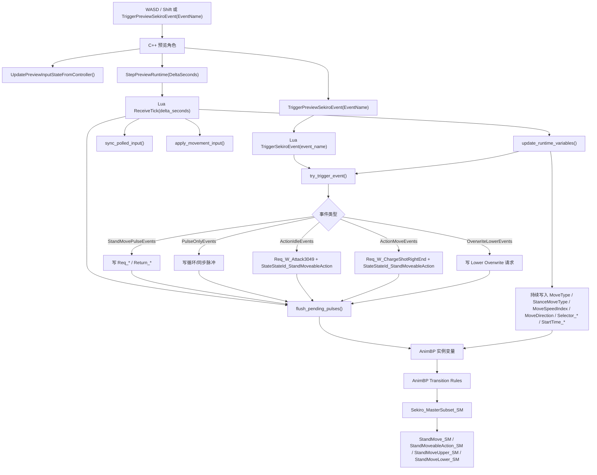
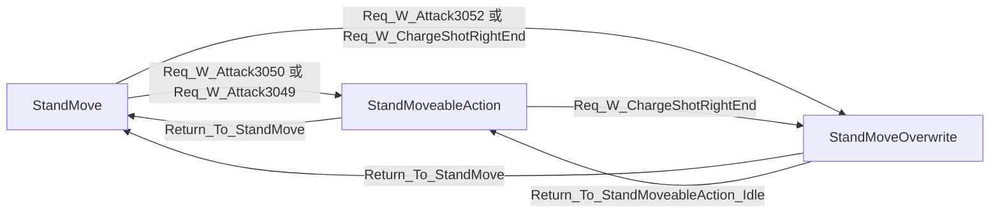
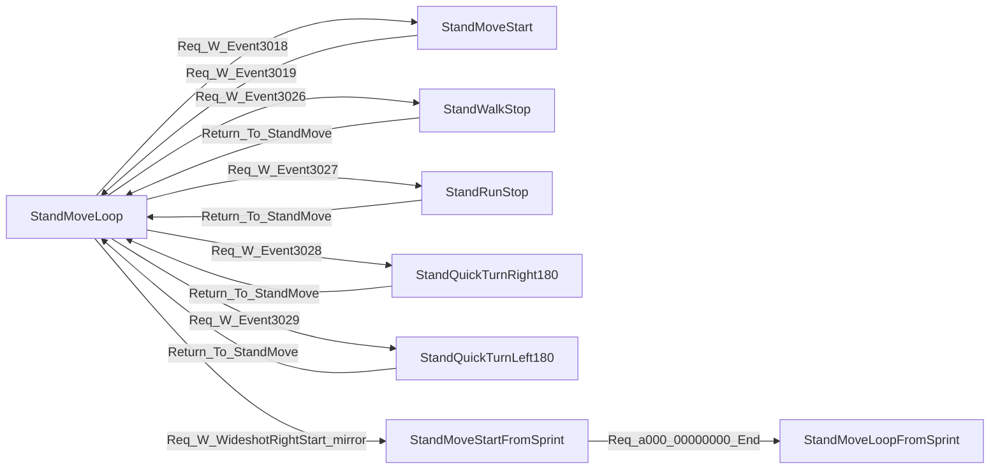
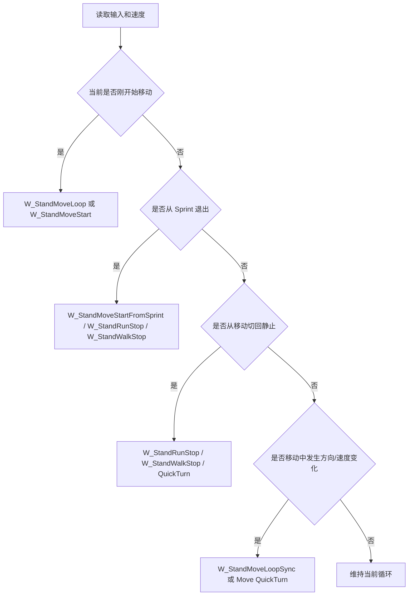
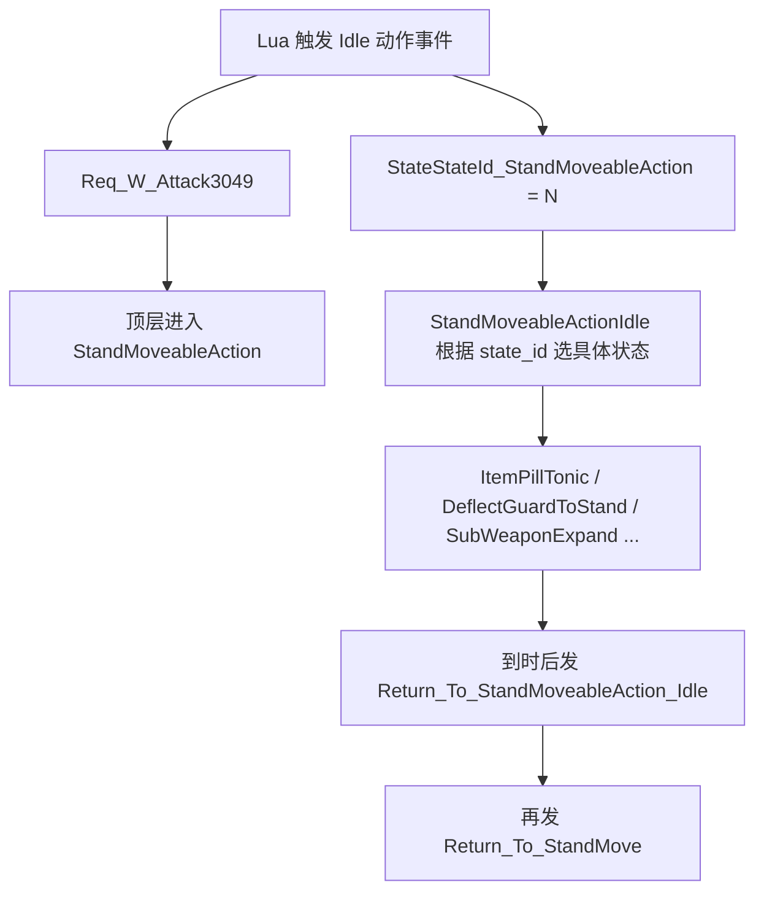
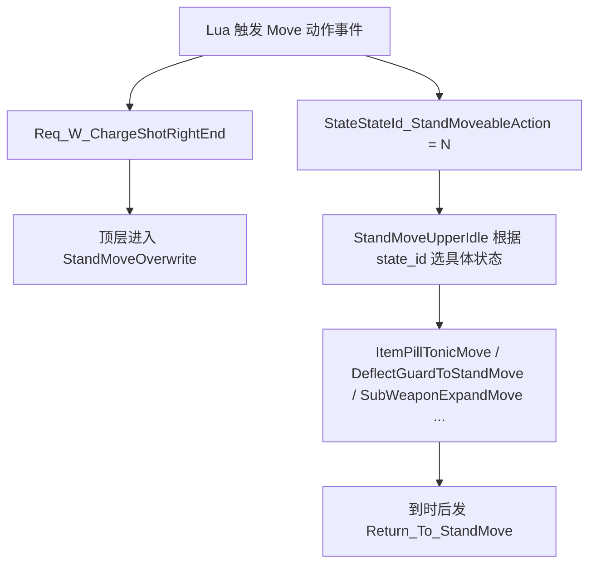
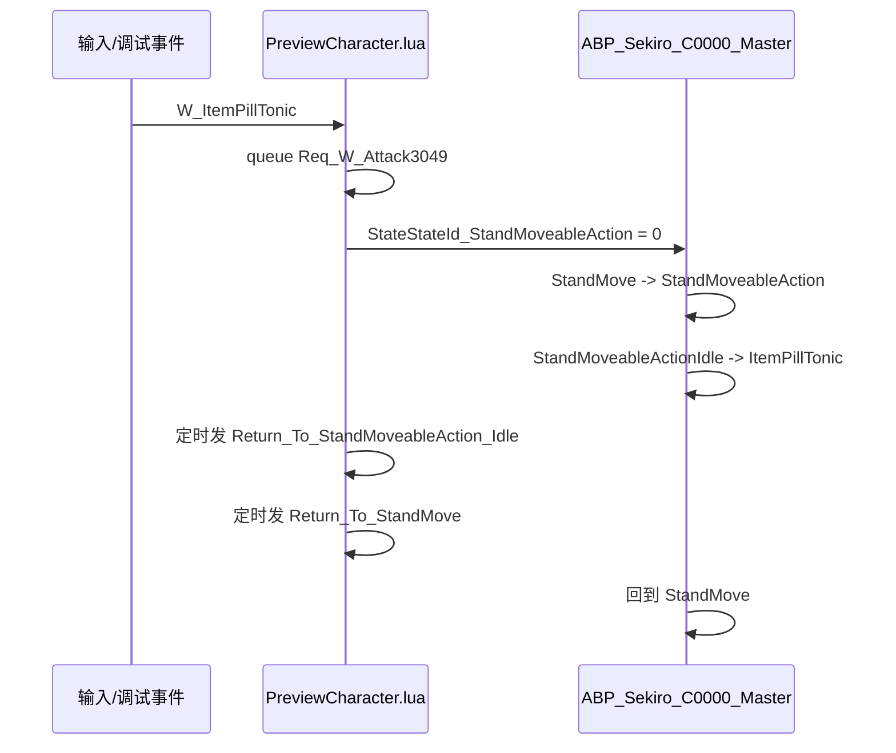
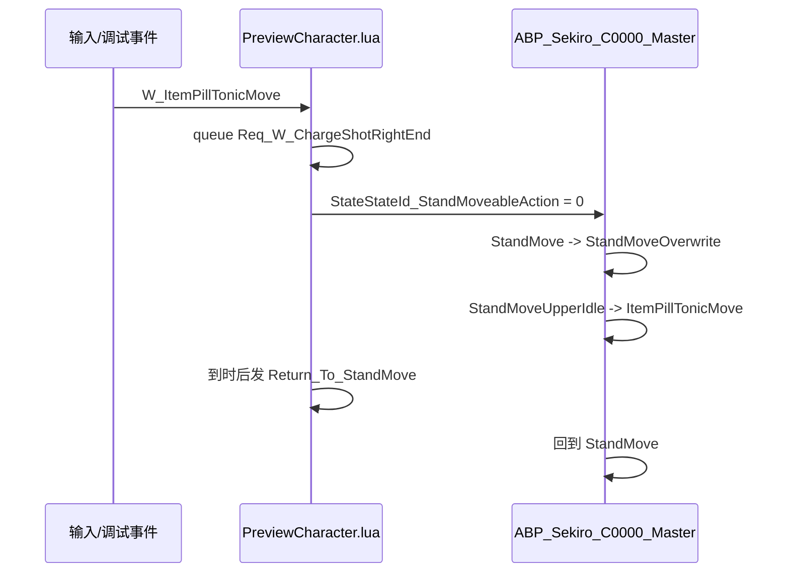

# Sekiro C0000 UE 动画状态机逻辑图

这份文档描述的是当前 `E:\UEProj\Sekiro\SekiroDemo` 工程里的 UE 预览实现，不是只狼原版 Havok 状态机本体。

## 总体机制

- 输入或调试事件先进入 `ASekiroC0000PreviewCharacter`
- C++ 把 Tick 和事件转发到 `PreviewCharacter.lua`
- Lua 不直接切 AnimGraph 状态，而是写 AnimBP 实例变量
- AnimBP transition rules 读取这些变量后，才真正进入目标状态

关键文件：

- `E:\UEProj\Sekiro\SekiroDemo\Source\SekiroDemo\SekiroC0000PreviewCharacter.cpp`
- `E:\UEProj\Sekiro\SekiroDemo\Content\Script\Sekiro\C0000\PreviewCharacter.lua`
- `E:\UEProj\Sekiro\SekiroDemo\Content\Script\Sekiro\C0000\EventSpecs.lua`
- `E:\UEProj\Sekiro\SekiroDemo\Saved\SekiroImportReports\c0000_master_animbp_mapping.json`
- `E:\UEProj\Sekiro\SekiroDemo\Saved\SekiroImportReports\c0000_transition_effect_tuning_report.json`

## 总流程图

## 顶层状态机

顶层主状态机是 `Sekiro_MasterSubset_SM`，入口状态是 `StandMove`。

对应关系：

- `StandMove -> StandMoveableAction`
  由 `Req_W_Attack3050` 或 `Req_W_Attack3049` 触发
- `StandMoveableAction -> StandMove`
  由 `Return_To_StandMove` 触发
- `StandMove -> StandMoveOverwrite`
  由 `Req_W_Attack3052` 或 `Req_W_ChargeShotRightEnd` 触发
- `StandMoveOverwrite -> StandMove`
  由 `Return_To_StandMove` 触发
- `StandMoveOverwrite -> StandMoveableAction`
  由 `Return_To_StandMoveableAction_Idle` 触发

## StandMove_SM 移动主干

`StandMove_SM` 是 `StandMove` 下面的子状态机，入口状态是 `StandMoveLoop`。

Lua 在 `update_runtime_variables()` 里大致按这个顺序决定触发什么事件：

## 动作状态机选态

这部分最关键的点是：

- `StandMoveableAction_SM` 入口是 `StandMoveableActionIdle`
- `StandMoveUpper_SM` 入口是 `StandMoveUpperIdle`
- 它们跳去哪个具体动作，不是靠一堆 `Req_*` bool 分别控制
- 而是靠 `StateStateId_StandMoveableAction == 某个整数`

常见例子：

- `state_id = 0`
  对应 `ItemPillTonic` 或 `ItemPillTonicMove`
- `state_id = 120`
  对应 `DeflectGuardToStand` 或 `DeflectGuardToStandMove`
- `state_id = 133`
  对应 `SubWeaponExpand` 或 `SubWeaponExpandMove`

## 变量职责拆分

### 1. 真正决定切到哪个状态的变量

- `Req_*`
- `Return_*`
- `StateStateId_StandMoveableAction`

### 2. 主要负责过渡样式和运动参数的变量

- `Selector_UseTransitionEffect`
- `Selector_UseStaterToStateTransitionEffect`
- `StartTime_01`
- `StartTime_02`
- `StartTime_03`
- `MoveType`
- `StanceMoveType`
- `MoveSpeedIndex`
- `MoveSpeedLevel`
- `MoveDirection`
- `MoveAngle`
- `TurnAngle`

## 具体事件例子

### 例 1：`W_ItemPillTonic`

### 例 2：`W_ItemPillTonicMove`

## 当前实现的一个重要特点

当前 Lua 默认：

- `enable_move_loop_transition = true`
- `enable_state_to_state_transition = true`
- `enable_sprint_action = true`
- `enable_item_use_move = true`
- `enable_direct_locomotion_preview = false`

因此当前预览实现里：

- 静止开始移动时，常常直接走 `W_StandMoveLoop`
- 不是每次都先走 `W_StandMoveStart`
- 移动中的速度档或方向切换，会用 `W_StandMoveLoopSync`
- 动作族切换时，`state_id` 负责“选哪个动作”，`Req_* / Return_*` 负责“什么时候进/什么时候退”

